# Array

- 通过index索引数据，通过index访问数据的时间复杂度为O(1)
- 时间复杂度
  - append：O(1)
  - pop：O(1)
  - insert：O(n)
  - delete：O(n)
  - lookup：O(1)


# Linkedlist

- 链表，维护好头节点和尾节点

- 时间复杂度
  
  - prepend O(1)
  - append：O(1)
  - pop：O(1)
  - **lookup：O(n)** 通过index访问数据
  - delete：O(1)
  - insert O(1)
  
- 通常是通过定义**node类**来实现链表的连接

  - ```python
    class node:
      def __init__(self,data,next,prev):
        	self.data = data
          self.next = next
          self.prev = prev
    ```

    

- 按照每个node是否有prev指针分类

  - 无prev指针：单链表
    - 尾node的next指针指向头节点：循环链表
  - 有prev指针：双向链表

- [leetcode LRU缓存策略](https://leetcode.com/problems/lru-cache/)


# Skip list

- **类似于二分查找**，每一级索引的数量是上一级的1/2（或者1/3，1/4等等），每一级都构成了Linked list
- **空间换时间**
- 通过index进行lookup的时间复杂度：O(logn)
  - 索引有k级，时间复杂度为O(k)
  - 假设最高级的索引有2个节点，则$2*2^k=n, k=log_2n-1$
- insert O(logn)
- delete O(logn)
- 空间复杂度：O(n)
- 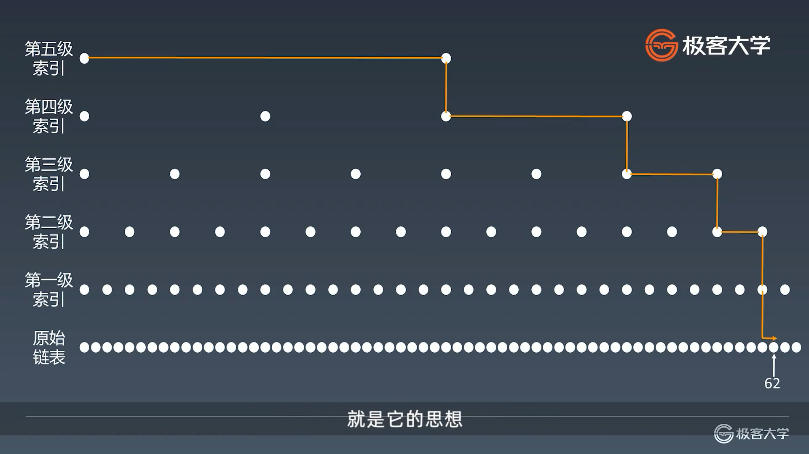
- [leetcode LRU缓存策略](https://leetcode.com/problems/lru-cache/)


# Stack

- First in - Last out
- Pop O(1)
- Lookup O(n)

# Queue

- First in - First out
- Lookup O(n)


# Double-End Queue

- 两端都可以进出的Queue
- Pop O(1)
- Insert O(1)

- 更加常用


# Priority Queue

- insert O(1)
- pop O(logn) 按照优先级pop出优先级最高的
- 底层具体实现的数据结构较为多样和复杂：heap，binary search tree，treap
- 一个概念
  - 这些数据结构都是对现实生活（或者业务）中某些逻辑的一种抽象
  - 设计出来都是有原因的


# Hash table

- 根据**关键码值（key value）**而直接进行访问的数据结构
- 通过把关键码值映射到表中一个位置来访问记录，以加快查找的速度
- 映射函数称之为**散列函数(Hash function)** ，存放记录的数组叫做**哈希表**
- 哈希碰撞：对于不同存储的数据，经过哈希函数后得到相同的值
  - 哈希碰撞的解决办法：存储为列表形式，也就是哈希之后得到相同的值的所有元素存储为列表
  - 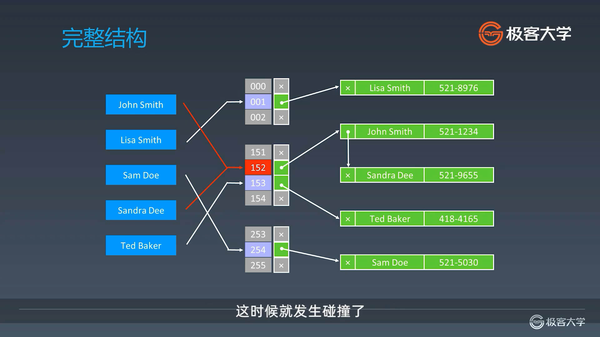
  - 如果哈希函数选的不好，就会导致经常发生哈希碰撞，导致退化为链表


## Map

- 利用哈希表得到的一种data structure
- Java,python,cpp中都有实现
- 注意：set也可以

# Set

- 利用哈希表得到的一种data structure

- Java,python,cpp中都有实现


# Tree

- Tree 和 Graph的主要区别在于Tree不能有环

- 主要在用的是二叉树

- 示例代码

- ```python
  class TreeNode:
    def __init__(self,val):
      self.val = val
      self.left,self.right = None,None
  ```

  

- 为什么要用树

  - 状态转移，从一个初始状态开始，每次都不同的action，都是一个分支

- 遍历

  - 共有三种遍历方式，区别在于顺序不同，利用**递归**

    - 前序遍历（preorder） 根 左 右
    - 中序遍历（inorder）左 根 右
    - 后序遍历（post-order）左 右 根

  - ```python
    class preorder:
      def preoder(self,root):
        if not root:
          return
        self.traverse_path_list.append(root.val)
        self.preorder(root.left)
        self.preorder(root.right)
        
    class inorder:
      def inorder(self,root):
        if not root:
          return
        self.inorder(root.left)
        self.traverse_path_list.append(root.val)
        self.inorder(root.right)
    class postorder:
      def postorder(self.root):
        if not root:
          return
        self.postorder(root.left)
        self.postorder(root.right)
        self.traverse_path_list.append(root.val)
    ```

## 二叉搜索树

- 左子树上的所有节点均小于根节点的值
- 右子树上的所有节点均小于根节点的值
- 以此类推，左右子树也是二叉搜索树

- 查询 O(logN)
  - 查找的时候，每次操作 都可以筛掉一半节点
- 插入 O(logN)
  - 插入实际上，还是一个查找，没有查找到，那么最后到达的位置就是要插入的位置
  - 最后到达的位置的概念是如果要插入的元素小于该节点，而该节点的左子树为空，那么就是最终停留的位置，也就是元素要插入在该节点的左节点处。同理，如果要插入的元素大于该节点，而给节点的右子树为空，那么这个节点就是最终停留的位置，也就是元素要插入在该节点的右节点处。
  - 同样是不断地递归
- 删除
  - 同样需要查找节点，如果删除的是叶节点，那么直接删，没有影响
  - 如果删除的不是叶节点，那么在该节点的右子树中遍历寻找第一个大于该节点的元素，要删除的节点替换为该节点
- 遍历 O(N)


# Trie

- 字典树，又称单词查找树或键树，是一种树形结构。典型应用是用于统计和排序大量的字符串，所以经常被搜索引擎系统用于文本词频统计
- 优点
  
  - 最大限度减少无谓的字符串比较，查询效率高于哈希表
- Trie树不是二叉树，而是n叉树
- 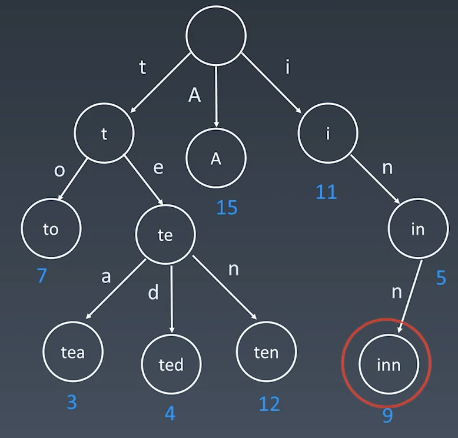

- 特点

  - 节点不存完整单词，节点本省存的是额外信息，比如频次
  - 从根节点道某一节点，路径上经过的字符连接起来，即为该节点对应的字符串
  - 每个节点的所有子节点路径代表的字符不同

  

- 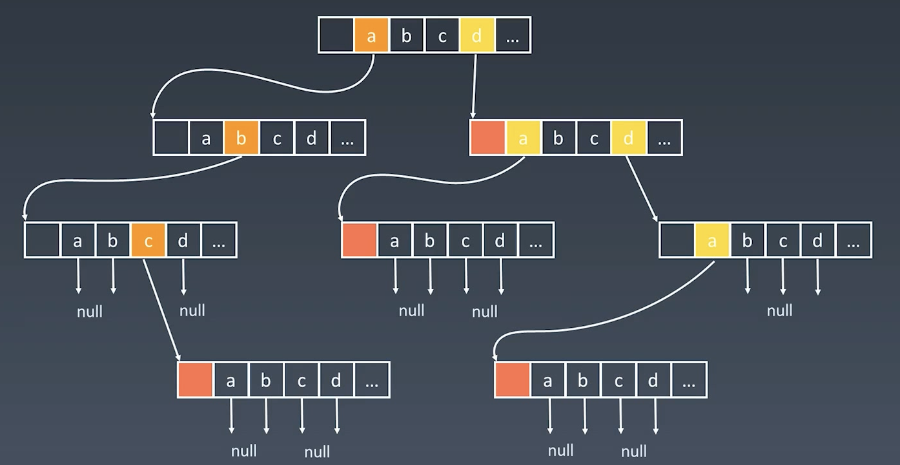

  
  - 在英文里，也就是26叉树

- 查询复杂度 O(n) n为要查找的单词的长度，因此比哈希表查找的速度快

- 核心思想：空间换时间


# DisjointSet

- Makeset(s)：建立一个新的并查集，其中包含s个蛋元素集合
- Unionist(x,y)：把元素x和元素y所在的集合合并，要求x和y所在的集合不相交，如果相交则不合并
- Find(x)：找到元素x所在集合的代表，该操作也可以用于判断两个元素是否位于同一个集合，只要将它们各自的代表比较一下就可以

- [一个通俗易懂的例子](https://blog.csdn.net/liujian20150808/article/details/50848646)

- 代码模版

  ```python
  class DisjointSet:
      def __init__(self, n):
          self.p = [i for i in range(n)]
      
      def find(self, x):
          r = x
          while self.p[r] != r:
              r = self.p[r]
          # path compression
          i = x
          while i != r:
              j = self.p[i]
              self.p[i] = r
              i = j
          return r
      
      def union(self, x, y):
          rootx = self.find(x)
          rooty = self.find(y)
          if rootx != rooty:
              self.p[rootx] = rooty
  ```


# 平衡二叉树

- 二叉搜索树如果维护不好的话，会导致退化为链表，导致查询效率降低，**保证查询效率的关键是二维的维度平衡**
- 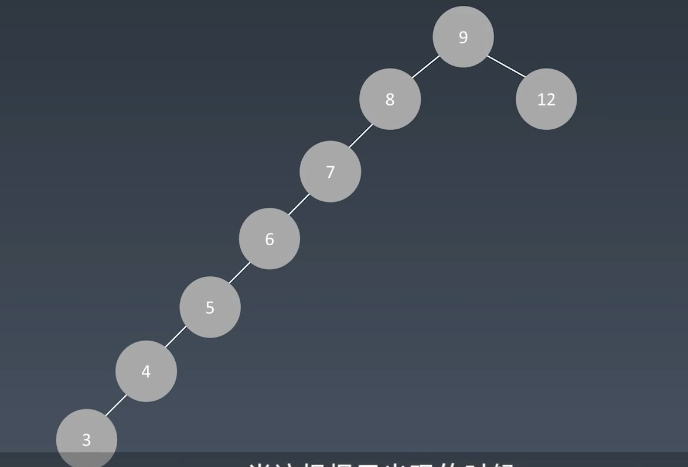


## AVL Tree

- **平衡因子 Balance Factor**
  - 右子树的高度 减去 左子树的高度
  - 保证 所有节点的balance factor = {-1,0,1}
  - 所有叶节点的平衡因子为0
- 旋转操作来实现平衡
  - **左旋：右右子树**
    - 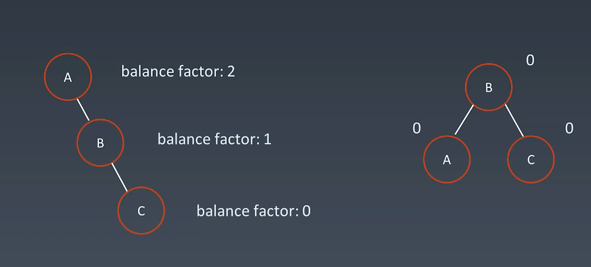
  - **右旋：左左子树**
    - 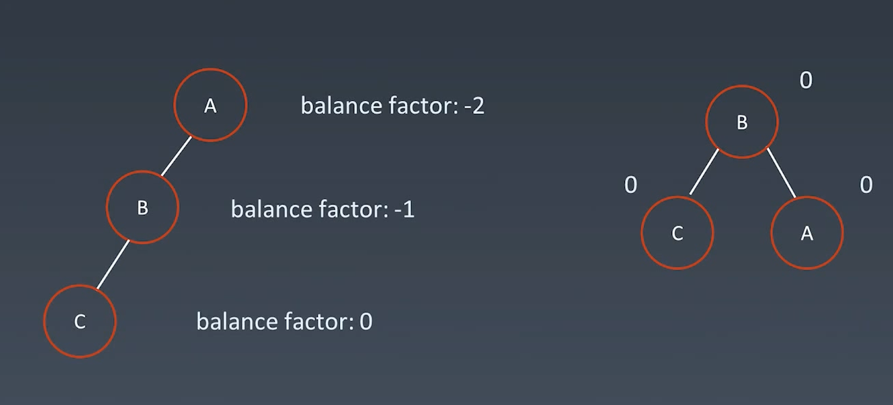
  - **左右旋：左右子树**
    - 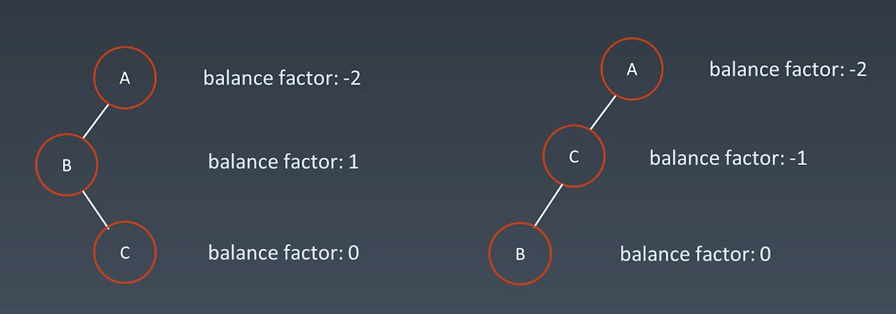
  - **右左旋：右左子树**
    - 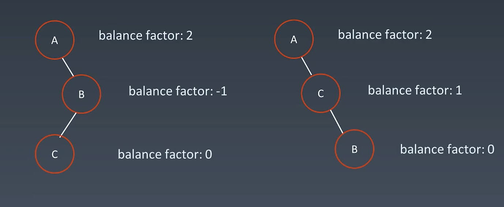
  - **带有子树的情况**
    - 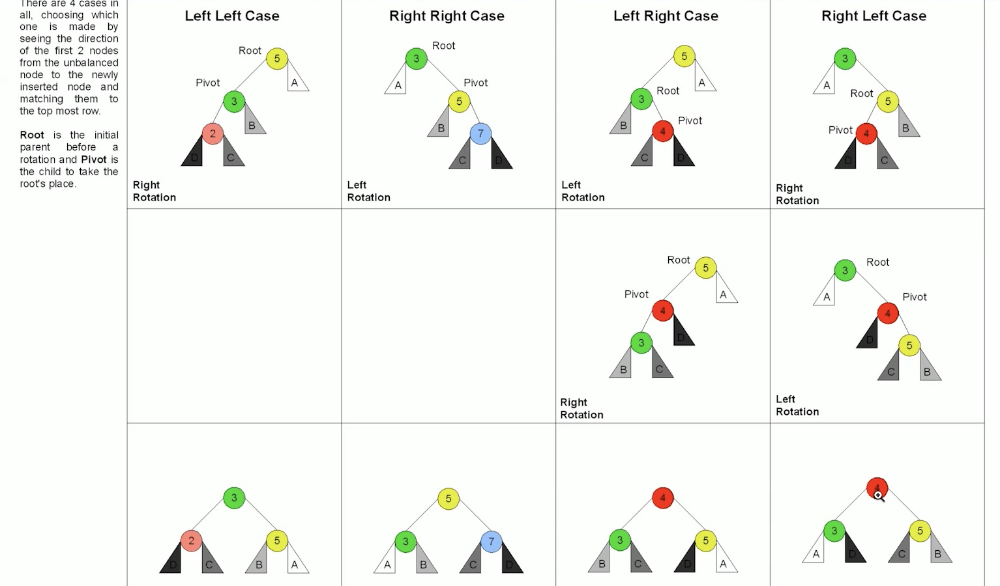

- 不足
  - 节点需要存储额外信息，且调整次数频繁


## 红黑树

- **近似平衡**的二叉搜索树，能够确保任何一个节点的左右子树的**高度差小于2倍**
  - 每个节点要么是红色，要么是黑色
  - 根节点是黑色
  - 每个叶节点（NIL节点，空节点）是黑色的
  - 不能有相邻接的两个红色节点
  - 从任一节点到其每个叶子的所有路径都包含相同数目的黑色节点

**红黑树和AVL的对比**

- AVL tree provides **faster lookups** than Red Black Trees because they are **more strictly balanced**
- Red Black Trees provide **faster insertion and removal** operations than AVL trees as fewer rotations are done due to relatively relaxed balancing
- AVL trees store balance **factors or heights** with each node, thus requires storage for an integar per node whereas Red Black Tree requires only 1 bit of information pre node
-  Red Black Trees are used in most of the **lanuage libiaries like map, multi map, multiset in C++** whereas AVL Trees are used in **databases** where faster retrieval are required.


# Bloom Filter

- 一个很长的二进制向量和一系列随机映射函数
- **可以用于检索一个元素是否在一个集合中**
- 优点：空间效率和查询时间远远超过一般的算法
- 缺点：有一定的误识别率和删除困难
- 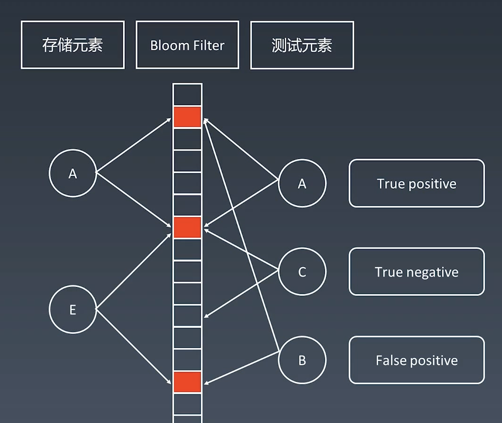

- 如果查找元素不在bloom filter中，那么一定不在

- 如果查找元素在bloom filter中，那么可能存在

- 代码模版

- ```python
  from bitarray import bitarray
  import mmh3
  
  class BloomFilter:
      def __init__(self, size, hash_num):
          self.size = size
          self.hash_num = hash_num
          self.bit_array = bitarray(size)
          self.bit_array.setall(0)
      
      def add(self, s):
          for seed in range(self.hash_num):
              result = mmh3.hash(s, seed) % self.size
              self.bit_array[result] = 1
      def lookup(self, s):
          for seed in range(self.hash_num):
              result = mmh3.hash(s, seed) % self.size
              if self.bit_array[result] == 0:
                  return False
          return True
  ```


# LRU Cache

- 两个要素
  - 大小
  - 替换策略
- LRU  最近最少使用（操作系统）
- 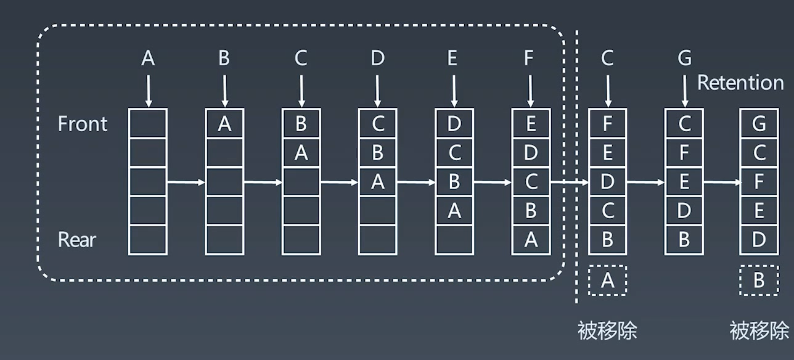

