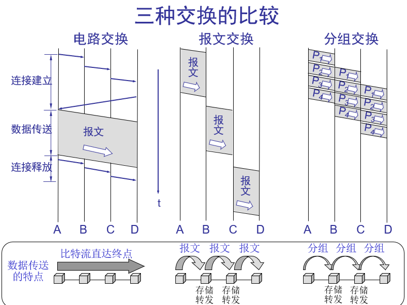
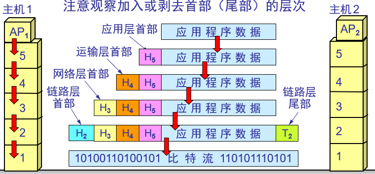

# 计算机网络概述

- 网络，互联网，因特网的区别
  - 网络由结点和链路组成，许多计算机连接在一起
  - 互联网（internet）是多个网络连接起来
  - 因特网（Internet）：全球最大的互联网
- 因特网发展的三个阶段
  - ARPNET 向互联网发展
    - 1969 分组交换网
    - 1975 互联网
    - 1983 TCP/IP协议
  - 三级结构因特网
    - 主干网+地区网+校园网
  - 多层次ISP 结构的因特网
- 网络标准化
  - 因特网协会 ISOC
    - 因特网研究部
    - 因特网工程部

## 因特网的组成

### 因特网的核心部分

- 数据交换方式
  - 电路交换方式：交换机
    - 三个步骤：申请占用通信资源（建立连接），一直占用通信资源（通话中），释放通信资源（释放连接）
  - 报文交换方式
    - 源数据不分组
    - 报文一般比分组长
  - 分组交换方式
    - 会将源数据分组
    - 分组：首部+数据
    - 分组的转发：不同分组路径不一定一致（路由器选择最佳路径）
  - 

### 因特网的边缘部分

- 主机、服务器
- 主机（服务器）之间的通信方式
  - 客户服务器方式 C/S
  - 对等连接方式 P2P
    - 用户越多，下载速度越快

## 计算机网络的定义

### 作用范围

- 广域网 WAN
- 城域网 MAN
- 局域网 LAN
  - 企业自己购买的设备组建网络
- 个人区域网 PAN

从网络的使用者分类

- 专用网
- 公用网
- 接入网（AN）

## 计算机网络的性能

- 速率： 连接在计算机网络的主机在数字信道上传送数据位数的速率 b/s,Mbs,Gb/s，这里的b是bit
  - 上行和下行占不同的信道
- 带宽： 数字信道所能传送的最高速率
- 吞吐量：单位时间内通过某个网络的数据量（上行+下行）
- 时延
  - 发送时延：数据块长度（bit）/信道带宽（bit/s）
  - 传播时延：信道长度/数据在信道上传送的速度
  - 排队时延：在路由器节点排队等待转发
  - 处理时延：路由器节点为分组选择最佳路径

- 时延带宽积：传播时延 x 带宽
- 往返时间：从发送方发送数据开始到发送方接收到数据为止
- 利用率
  - 信道利用率：有数据通过时间/（有+无）数据通过时间
    - 信道利用率增大，时延增大

## 计算机网络的体系结构

名词解释：

- ISO(International Organization for Standardization)  国家标准化组织
- OSI(Open System Interconnection) 互联网法律上的国际标准
- TCP/IP 因特网事实上的国际标准
- Network Protocols 数据交换遵守的规则，标准或约定
- 网络体系结构  计算机网络各层及其协议的集合
- 实体（entity）：交换信息的硬件和软件进程
- 协议（protocol）：控制两个**对等实体**通信的规则
- 服务（service）：下层向上层提供服务，上层需要使用下层提供的服务来实现本层的功能
- 服务访问点(SAP）：**相邻两层实体**间交换信息的地方

## OSI 7层模型

- 应用层：能够产生**网络流量**，能够和用户交互的应用程序
- 表示层：加密，压缩，解压缩，编解码
- 会话层：服务和客户端建立的会话
- 传输层
  - 可靠传输（建立会话）：丢包重传
  - 不可靠传输（不建立会话）
  - 流量控制
- 网络层：选择最佳路径，IP地址编址
- 数据链路层：输入的数据如何封装，添加物理层地址（MAC地址）
- 物理层：电压接口标准

## TCP/IP

- 应用层：HTTP，SMTP，DNS，RTP，...
- 传输层：TCP，UDP
- 网际层：IP
- 网络接口层

## 混合5层模型

1. 应用层：传输数据单元
2. 传输层：运输层报文
3. 网络层
4. 数据链路层
5. 物理层

通俗点来说，应用层将数据分段，在传输层对每段根据TCP/IP协议加一个head，之后网络层给每段加上IP地址（成为IP数据包或者分组），数据链路层加上MAC地址（组成帧），物理层传输比特流。接收端做的一系列去除首部+尾部的工作

