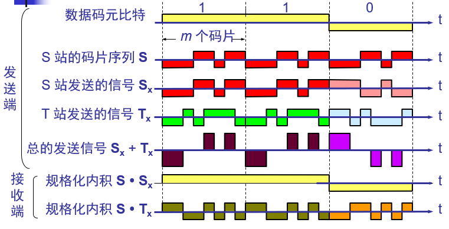
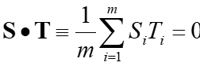

# 物理层

- 解决如何在连接各种计算机的**传输媒体**上**传输数据比特流**，不是指具体的传输媒体
- 机械特性
- 电气特性

## 数据通信的基础知识

- 信道：向一个方向传送信息的媒体
  - 单工通信
  - 半双工通信
  - 全双工通信
- 基带信号
  - 单极性不归零码
  - 双极性不归零码
  - 单极性归零码
  - 双极性归零码
  - 曼彻斯特编码
    - 低到高为 0 ，高到低为1
  - 差分曼彻斯特编码
- 奈奎斯特速率：在假定的理想状态条件下，为了避免码间串扰，最高码元传输速率：$R = 2W$ W为理想低通信道的带宽，R为码元传输速率
- 香农公式：带宽受限且有高斯白噪声的信道的极限信息传输速率，$C=Blog_2(1+\frac{S}{N})bit/s$

## 物理层的传输媒体

- 导向传输媒体：电磁波沿着固体媒体传播

  - 双绞线
    - 屏蔽双绞线
    - 无屏弊双绞线
  - 同轴电缆
    - 50欧姆 同轴电缆
    - 75欧姆同轴电缆
  - 光纤

- 非导向传输媒体

  - 短波通信：电离层反射
  - 微波通信：直线传播，需要发射塔
  - ...

- 集线器（Hub）

  - 放大信号和重发，扩大网络的传输范围
  - 集线器连接的网络属于半双工，是一个大的冲突域

  

  

  

  

## 信道复用

- 频分复用 FDM
- 时分复用 TDM
  - 统计时分复用
- 波分复用 WDM
- 码分复用 CDM
  - 码分多址 CDMA

### 码分复用

- 每个站（eg:每个不同的手机）分配一个单独的mbit 码片序列
  - 当实际发送的比特为1时，则发送该码片序列
  - 当实际发送的比特为0时，则发送该码片序列的反码
- 不同站之间的码片序列是**正交**的
- **不同站发送的码片序列相加，也就是最终总的发送信号**
- 接收时，每个站用自己的码片序列去和接收到的序列做内积，如果结果为1或者-1，表明接收到了消息，为1或者0，否则说明没有消息传来
- 内积的计算
  - 

## 数字传输系统

**PCM**

两个标准

- 北美的24路PCM（T1） 1.544Mb/s

  - 每秒采样8000次，8bit，24路话音信号，$8000\times （8 \times 24+1) = 2.048Mb/s$，1bit的控制信号

- 欧洲的30路PCM（E1）Mb/s 2.048 $8000\times(8\times30+2\times8) = 2.048Mb/s$，2个8bit的控制信号

  - 我国采用
  
  

## 带宽接入技术

- **xDSL(Digital Subscriber Line)**

  - 对现有的模拟电话用户线改造，使得其可以承载互联网业务
  - 将0-4kHz低端频谱留给传统电话使用，将高端频谱留给互联网业务
  - {7XB[7Q`6SCYH8CLB.jpg)
  - 利用FDM技术

- **光纤同轴混合网（HFC,Hybrid Fiber Coax)**

  - 对现有的CATV网进行改造，在原有的同轴电缆基础上，加装光纤以及光纤节点
  - 
  - 模拟光纤从头端连接到光纤结点(fiber node)，即光分配结点 ODN (Optical Distribution Node)。在光纤结点光信号被转换为电信号。在光纤结点以下就是同轴电缆。

- **FFTx**

  - 光纤到家 **FTTH** (Fiber To The Home)：光纤一直铺设到用户家庭可能是居民接入网最后的解决方法
  - 光纤到大楼 **FTTB** (Fiber To The Building)：光纤进入大楼后就转换为电信号，然后用电缆或双绞线分配到各用户。
  - 光纤到路边 **FTTC** (Fiber To The Curb)：从路边到各用户可使用星形结构双绞线作为传输媒体

  