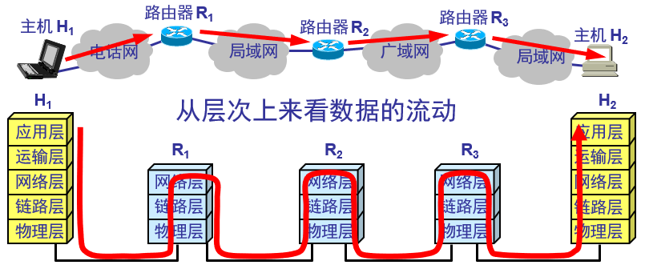
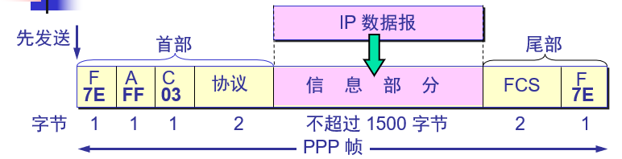

# 数据链路层

- 路由器在链路层检查目的Mac地址是否是自己，若是则进入网络层，根据IP地址选择下一跳地址，将数据帧的Mac地址写为目的路由器（主机,...）的Mac地址

数据链路层使用的信道

- 点对点信道
- 广播信道

链路：点到点的物理线路段

数据链路：链路+通信协议

数据链路层解决的三个问题

- **封装成帧**：帧头，帧尾
- **透明传输**
  - 通过转义字符，使得传输数据内容不同于枕头和帧尾
- **差错控制**
  - CRC 循环冗余校验
    - 在数据后面添加的冗余码称为帧检验序列**FCS （Frame Check Sequence)**
  - 有差错，丢掉，但是不管是否要重传

## 点对点协议

PPP协议

- 优点
  - 身份验证
  - 简单
  - 封装成帧
  - 透明传输
  - 支持多种网络层协议
  - 支持多种链路
- 帧的格式
  - 
  - 最开始的7E表示帧的起始，最末的7E表示帧的结束
  - 接下来的FF表示目标地址，但是由于点对点，因此目标地址无意义，写为FF
  - 协议部分表示传输的数据是什么数据
    - 0x0021 时，表述传输的是IP数据报
    - 0xC021, 表示传输的是 PPP 链路控制数据。
    - ...
  - FCS 冗余校验码
- 如何实现透明传输
  - 异步传输：字符填充法
    - 若信息字段出现7E，将7E拆分为7D和5E
    - 若信息字段出现7D，则7D写为7D和5D
  - 同步传输：零比特填充
    - 在发送端，只要检测到连续5个1，则在后面插入一个0
    - 接受端，检测到连续5个1，删除后面的的一个0

路由器的以太网口一般用来组建局域网，serial口用来组建广域网