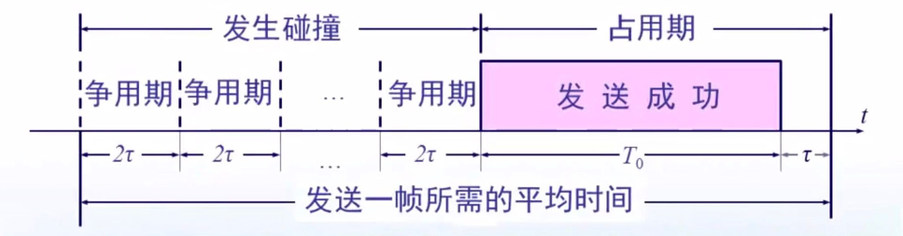
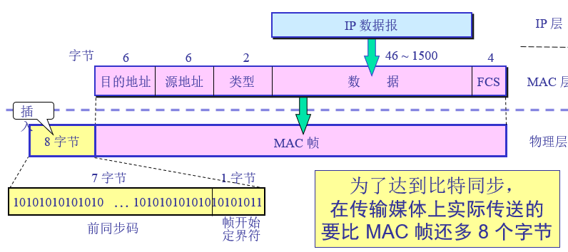

# 数据链路层

- 路由器在链路层检查目的Mac地址是否是自己，若是则进入网络层，根据IP地址选择下一跳地址，将数据帧的Mac地址写为目的路由器（主机,...）的Mac地址

**数据链路层传输的是帧**

数据链路层使用的信道

- 点对点信道：PPP协议
- 广播信道：CSMA/CD协议

链路：点到点的物理线路段

数据链路：链路+通信协议

数据链路层解决的三个问题

- **封装成帧**：帧头，帧尾
- **透明传输**
  - 通过转义字符，使得传输数据内容不同于枕头和帧尾
- **差错控制**
  - CRC 循环冗余校验
    - 在数据后面添加的冗余码称为帧检验序列**FCS （Frame Check Sequence)**
  - 有差错，丢掉，但是不管是否要重传

## 点对点协议

点对点线路

PPP协议

- 优点
  - 身份验证
  - 简单
  - 封装成帧
  - 透明传输
  - 支持多种网络层协议
  - 支持多种链路
- 帧的格式
  - 
  - 最开始的7E表示帧的起始，最末的7E表示帧的结束
  - 接下来的FF表示目标地址，**但是由于点对点，因此目标地址无意义，写为FF**
  - 协议部分表示传输的数据是什么数据
    - 0x0021 时，表述传输的是IP数据报
    - 0xC021, 表示传输的是 PPP 链路控制数据。
    - ...
  - FCS 冗余校验码
- 如何实现透明传输
  - 异步传输：字符填充法
    - 若信息字段出现7E，将7E拆分为7D和5E
    - 若信息字段出现7D，则7D写为7D和5D
  - 同步传输：零比特填充
    - 在发送端，只要检测到连续5个1，则在后面插入一个0
    - 接受端，检测到连续5个1，删除后面的的一个0
  - 什么是同步传输：传输以bit为单位，异步传输以字节为单位进行传输

## 局域网

路由器的以太网口一般用来组建局域网，serial口用来组建广域网

拓扑

- 星型网
  - 集线器
  - 本机发送的消息其他连入此集线器的设备都可以收到，除了本机
- 总线网
- 环形网
- 树形网

### 共享通信媒体

静态划分信道

- 频分复用
- 时分复用
- 波分复用
- 码分复用

动态媒体接入控制

- 随机接入（以太网）

## 以太网

广播型信道

局域网

**CSMA/CD协议**（Carrier Sense Multiple Access/collision detection）

- 多点接入：许多计算机以多点接入的方式连在一根总线上

- 载波监听：每一个站在发送数据之前检测总线上是否有其他计算机在发送数据，如果有，则暂时不要发送数据，发送数据后，对冲突进行检测，若有冲突，则取消发送
- 半双工通信

### 争用期

- 计算机发送数据后，最多经过$2\tau$ 时间检测到是否发生了碰撞，端到端传播时延的两倍
- 以太网中规定$2\tau =51.2\mu s$ ,对于10Mb/s的以太网，在争用期可以发送512bit，即64byte
- 也就是说，发送的最开始64byte没有发生冲突，则后续发送的数据不会有冲突，而发生冲突也只可能发生在最开始发送的64byte中
- 由于一检测到冲突立马停止发送，这是发出的数据小于等于64byte，因此以太网规定最短有效帧长64byte，收到的帧长小于64byte的都是无效帧
- 注意：**在数据链路层，是一帧一帧发的，也就是相邻两帧可以不连着发，但是一帧内的所有Bit必须连着一起发**

### 二进制指数类型退避算法

- 发生碰撞后，先停止发送数据，之后推迟一个随机时间再发送数据（当然发送数据前仍然要利用CSMA/CD协议）
- 基本退避时间，$2\tau$，端到端传播时延的两倍
- 定义重传次数 *k* ，$k\le 10$，即 *k* = Min[重传次数, 10]
- 从整数集合[0,1,…, ($2^k$ -1)]中随机地取出一个数，记为 *r*。重传所需的时延就是 *r* 倍的基本退避时间。
- 当重传达 16 次仍不能成功时即丢弃该帧，并向高层报告

**以太网的两个标准**

- DIX Ethernet V2  --》严格意义上的以太网
- IEEE 802.3

**以太网数据链路层的2个子层**

- 逻辑链路控制 LLC（Logical Link Control)   --》现在基本不用
- 媒体接入控制MAC（Medium Access Control）

**以太网提供的服务**

- 不可靠的交付
- 帧出错，就丢弃此帧，不做其他的事情

主要采用星型拓扑

### 信道利用率

- 帧长为L（bit），数据发送率为C（b/s），帧的发送时间$T_0 = \frac{L}{C}$
- 争用期长度$2\tau$
- 定义一个参数$\alpha = \frac{\tau}{T_0}$
- $\alpha$ 越大，信道利用率越大，争用期越短（端到端距离越短），帧长越长，信道利用率越大

- 极限信道利用$S_{max}=\frac{T_0}{T_0+\tau}=\frac{1}{a+\alpha}$（理想情况，没有争用期，没有冲突）
- 

### MAC地址

- 每个网卡有一个全球唯一的MAC地址，固定到芯片上
- 48位二进制，前24位标识厂家，后24位厂家指定

### MAC帧

