# 网络层

## 前引

网络层关注**如何将分组从源端沿着网络路径送达目的端**

**在计算机中，可靠传输通过端系统实现**

**网络层中传输的是IP数据报**

**网络层提供的两种服务**

- 虚电路服务
  - 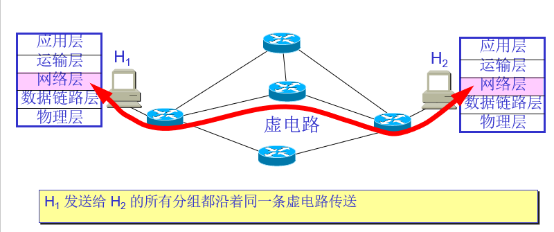
- 数据报服务
  - 网络在发送分组时不需要先建立连接。每一个分组（即 IP 数据报）独立发送，与其前后的分组无关（不进行编号）
  - 现在互联网利用数据报服务

**虚拟互联网**

中间设备又称为中继系统

- 物理层的中继系统：转发器
- 数据链路层中继系统：网桥，交换机
- 网络层中继系统：路由器
- 网络层以上中继系统：网关（gateway)
  - 一般计算机的网关配置为相连路由器的IP地址
  - 不配置网关的计算机无法访问其他网段

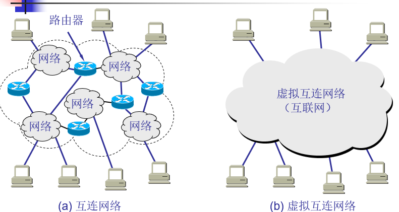

**与网际协议IP配套使用的协议**

- **地址解析协议 ARP （Address Resolution Protocol）**
- **逆地址解析协议 RARP （Reverse Address Resolution Protocol）**
- **网际控制报文协议 ICMP （Internet Control Message Protocol）**
- **网际组管理协议IGMP （Internet Group Management Protocol）**

## IP地址

**IP层次结构**

- 层次化IP地址将**32位的IP地址分为网络ID和主机ID**
- 比如192.168.1.2 ，网络ID 192.168.1 主机ID 2
- 主机ID不能全0，也不能全1，全为1表示广播地址，全为0表示本地网段

**IP地址记法（点分十进制记法）**

- 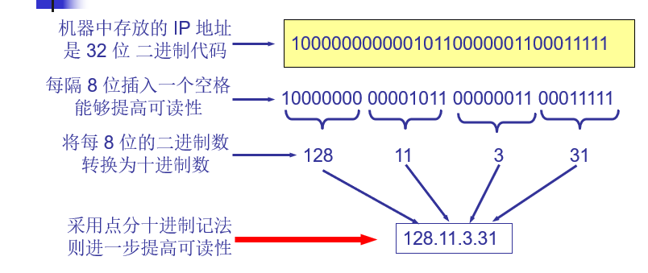

- 128，192，224，240，248，252，254，255

IP地址分类

-  A类地址，默认子网掩码 255.0.0.0
- B类地址    默认子网掩码 255.255.0.0
- C类地址    默认子网掩码  255.255.255.0
- 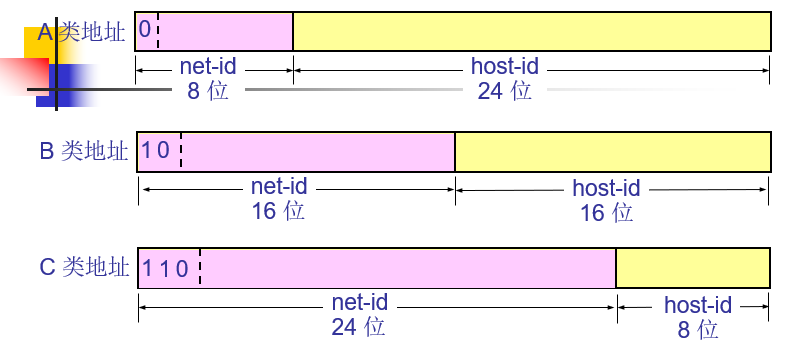
- 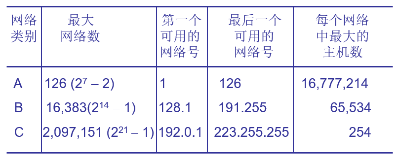

**特殊的几个地址**

- 127.0.0.1 本地环回地址
- 172.16.0.0  -- 172.31.0.0  私有地址，互联网无法访问，一般用于内网
- 192.168.0.0 -- 192.168.255.0  私有地址，互联网无法访问，一般用于内网

**子网掩码**

- 用于指明一个IP地址的哪些位标识主机所在的子网（网段），以及主机所在的host id
- 与运算

**子网划分**

关键在于确定子网掩码

比如192.168.0 网段划分为2个网段，那么**子网掩码为255.255.255.128**，**两个网段为192.168.0.0 和192.168.0.128**

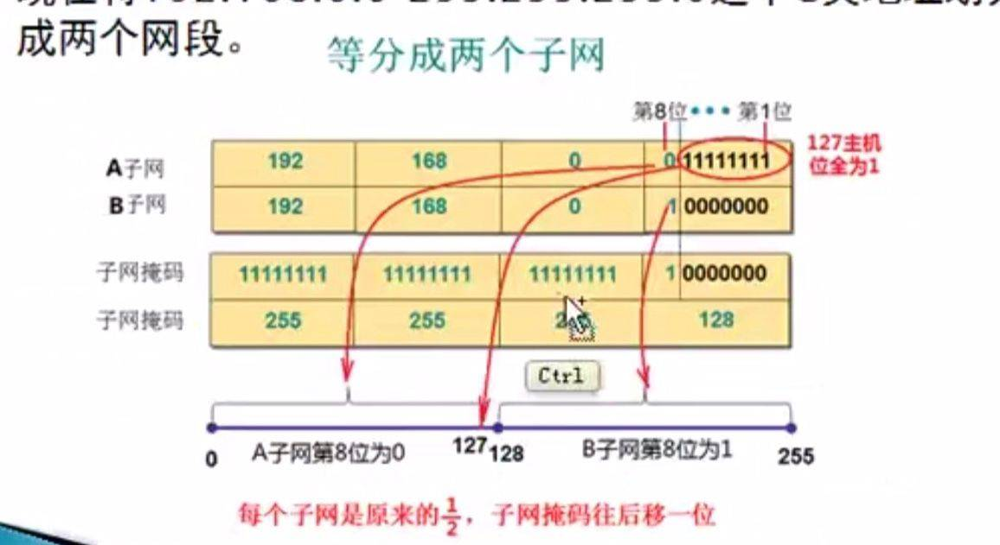

**192.168.0.0 网段主机IP地址范围为192.168.0.1 到 192.168.0.126，192.168.0.128网段主机IP地址范围为192.168.0.129到192.168.0.254**

- **主机ID不能全0或者全1**

实际上，主机ID与网络ID是一个你增我减的关系，当网络ID位数增加（子网掩码位数增加）时，该网段可以容纳的主机数减少，而网络ID位数减少（子网掩码位数减少）时，该网段可以容纳的主机数增加。因为总位数是一定的，为32位。**根据子网内容纳的主机数来确定子网掩码位数**

换句话说，如果说一个主机的IP地址一定了，那么这32位就已经定了，做所谓的子网划分，网络合并等等都是在决定子网掩码占多少位，主机ID占多少位

**构造超网（CIDR）**

如192.168.0.0/24 与 192.168.1.0 /24合并，192.168.00000000.00000000 和 192.168.000000001.00000000 进行合并，选择**共同位数最多的部分**，192.168.00000000，也就是192.168.0 网段，子网掩码255.255.254.0

## IP 地址 与MAC地址

- IP地址决定了最终目的地与最起始地址
- MAC地址决定了下一跳地址
- 因此在数据传播的过程中，MAC地址会变，而IP地址不会变
- 也就是每经过一次路由器，MAC地址就会变一次（源，目的地），而IP地址（源，目的地）却不会变

**ARP协议**

- **将IP地址解析为MAC地址**
- 主机发送信息时将包含目标IP地址的ARP请求**广播**到**局域网络**上的所有主机，并接收返回消息，以此确定目标的**物理地址**；收到返回消息后将该IP地址和物理地址存入本机ARP缓存中并保留一定时间，下次请求时直接查询ARP缓存以节约资源。

- ARP 欺骗
  - ARP 为获得MAC地址时，获得了一个错误的MAC地址，这样ping 该IP地址时，实际上一直在ping的是一个错误的MAC地址

**RARP协议**

- 将MAC地址解析为IP地址

## IP数据报

IP协议

格式：首部+数据部分

- 首部的前一部分固定长度，20字节，所有IP数据报必须具有
- 首部固定部分后面的是一些可选字段，其长度可变

- 数据部分可变长度

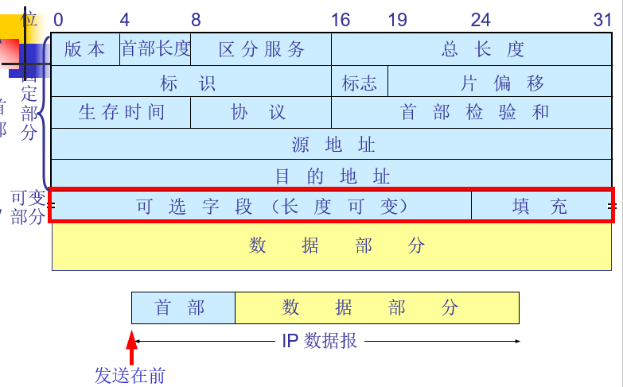

- 版本：IP协议版本号，如4表示IPV4

- 区分服务：用于表示数据的紧急程度，不仅仅数据包需要配置，路由器也需要配置，比如区分服务部分为100表示最紧急，那么经过的路由器需要配置为当区分服务部分为100，最紧急

- **总长度**：首部+数据部分之和的长度

- **标识**：产生数据报的标识

- **标志**：目前只有前两位有意义。

  - 标志字段的最低位是 **MF** (More Fragment)。MF = 1 表示后面“还有分片”。MF = 0 表示最后一个分片。

  - 标志字段中间的一位是 **DF** (Don't Fragment) 。只有当 DF = 0 时才允许分片。 

  

- **片偏移**：当数据报太大，需要分片发送，记录发送数据的偏移

  - 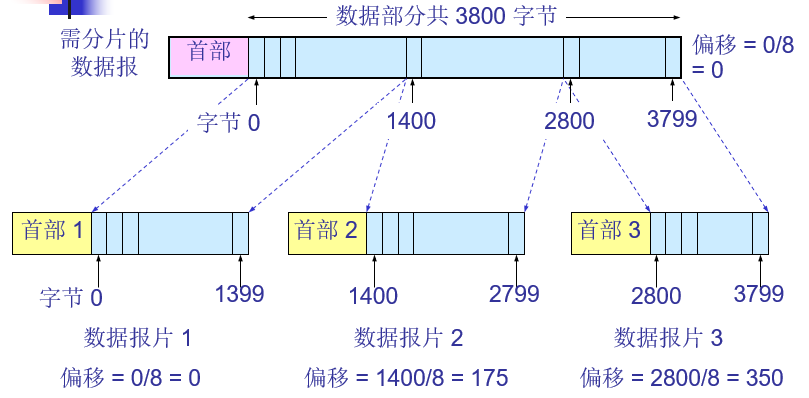

- **生存时间（TTL）**：每过一个路由器减1，表示数据报可以经过的最多的路由器
- **协议**：指明上层协议（传输层的协议）
  - 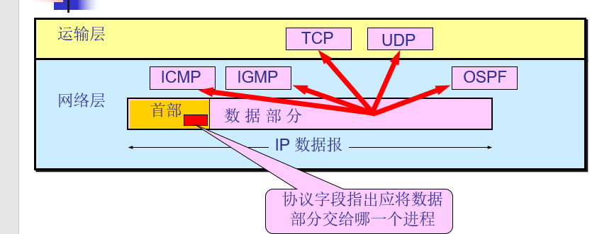

- **首部校验和**：**检查首部是否有错误，不校验数据部分是否有错误**

## ICMP

- ICMP 差错报告报文
- ICMP 询问报文

ICMP 报文的格式：可以看到实际上仍然是IP协议的报文，只不过首部的协议部分会指明数据部分是ICMP报文，同时数据部分有着ICMP报文自己的格式

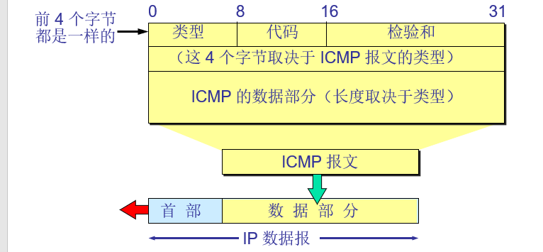

**ICMP 差错报告报文的五种错误类型**

- 终点不可达 
- 源点抑制(Source quench)  

- 时间超过 

- 参数问题 

- 改变路由（重定向）(Redirect) 

**ICMP差错报告报文的格式**

- 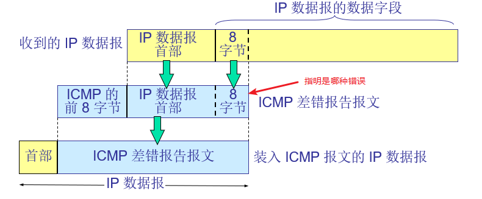 

**ICMP询问报文**

- 回送请求和回答报文
  - PING 使用了 ICMP 回送请求（request）与回送回答（reply）报文。
- 时间戳请求和回答报文

## 静态路由协议

- 提前指定下一跳地址
- 比如指定目的地址为192.168.16.1的下一跳地址为该路由器直连网段上的192.168.14.2

## 动态路由协议

### RIP协议

（Routing Information Protocol）协议

内部网关协议

基于距离矢量的路由协议

- 最早的动态路由协议
- 周期性广播（30s），广播每个路由器直连的网段
  - 周期性广播可以达到动态调整路由的效果
  - 这里的广播实际做法是告诉相连的路由器自己直连的网段
- 选择最佳路径：跳数
- **最大16跳**

### OSPF

(Open Shortest Path First) 协议

内部网关协议

基于链路状态的路由协议

- 最佳路径：带宽
- 支持多区域
- 触发式更新
- 三个表
  - 邻居表：hello包（邻居之间互发hello包），相邻路由器是否健在
  - 链路状态表
    - 向本自治系统中所有路由器发送信息，发送的信息就是与本路由器相邻的所有路由器的链路状态
    - 只有当链路状态发生变化时，路由器才用洪泛法向所有路由器发送此信息
  - 计算路由表

## 外部网关协议

BGP协议

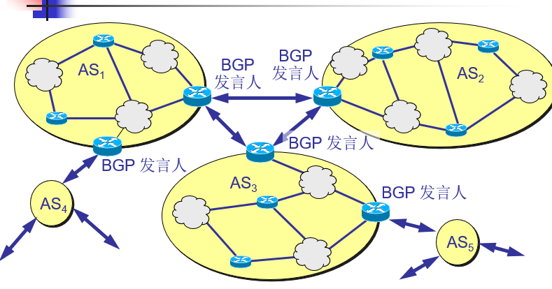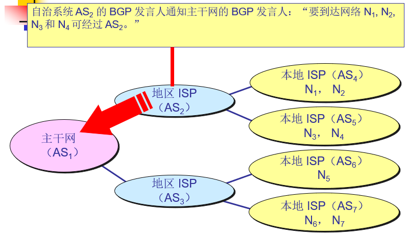

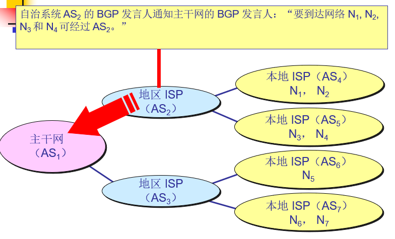

## NAT(网络地址转换)

**使得内网可以访问外网。**

正常情况下，内网中的主机使用的IP地址为上面说的私有IP地址，外网是访问不了内网的，因为不同内网的主机会使用相同的私有IP地址。而NAT做的是内网的主机访问外网时，经过路由器，路由器会将该源IP替换为一个外网IP。而外网的数据报回来时，再将目的IP地址替换为内网的IP地址

严格意义上的NAT是路由器预先分配一些可用的外网IP地址，之后内网的主机访问外网时，将其IP地址替换为可用的外网IP地址中的一个，这样就会有一个问题，内网同一时间可以访问外网的主机数目有限（分配的外网IP地址有限）

我们现在使用的实际上是NAT的变体，PAT以及NAPT。也就是将内网中不同主机映射为一个外网IP地址，但是是不同的端口号。PAT是<内网IP地址><外网IP地址+端口号>，NAPT是<内网IP地址+内网端口号><外网IP地址+端口号>

