# 传输层

**传输层两个协议**

- **TCP**
- **UDP**

**传输层和应用层的关系**

- 端口关系
  - http = TCP + 80 
  - https = TCP + 443
  - ftp = TCP + 21
  - SMTP = TCP + 25
  - POP3 = TCP + 110
  - RDP = TCP + 3389
  - DNS = UDP + 53
- 应用层协议的服务的关系
  - 利用端口来定位服务，利用IP地址定位主机
  - 一台主机可以同时开多个服务，也就是开多个端口，不同的服务侦听不同端口的客户端请求
  - 但是主机访问其他主机的某个端口，源端口任意

**端口转发**

- 这个使用的例子很多，比如开一个docker，将docker的22端口转发到主机的777端口，这样通过主机的777端口使用SSH连接docker
- 同样，可以将内网中某台主机的某个端口转发到路由器上某个外网IP的某个端口，这样通过该端口访问内网该主机

**防火墙**

- 其他设备无法访问本机端口
- 但是本机依然正常访问其他主机/设备
- 关掉了本机开放的端口

**端口分类**

- 熟知端口，数值一般为 0~1023。
- 登记端口号，数值为1024~49151，为没有熟知端口号的应用程序使用的。使用这个范围的端口号必须在 IANA 登记，以防止重复。
- 客户端口号或短暂端口号，数值为49152~65535，留给客户进程选择暂时使用。当服务器进程收到客户进程的报文时，就知道了客户进程所使用的动态端口号。通信结束后，这个端口号可供其他客户进程以后使用。
- 端口0-65535

TPDU：运输协议数据单元 两个对等运输实体再通信时传输的数据单位

TCP 报文段：TCP 传送的协议数据单元

UDP报文：UDP传送的协议数据单元

## UDP

- **不可靠的传输**
- 一个数据包就能完成的数据通信
- **不建立会话，无连接**
- 多播
- **面向报文的传输层协议**

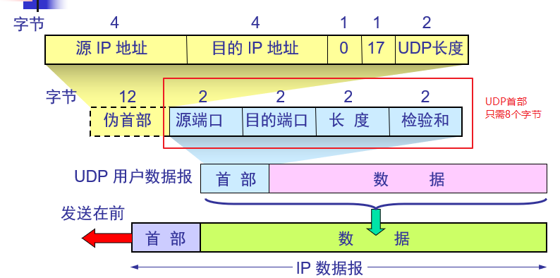

- 伪首部的作用是在校验中，校验首部+数据部分是否在传输过程中出错，

## TCP

- **可靠传输**
- 分组，并进行编号，按照编号依次传输
- **流量控制**
- **需要建立会话**
- 应用：访问网站
- **面向连接的传输层协议，点对点**
  - **点是什么：IP地址+端口**
  - 套接字（Socket)= （IP地址：端口号）
- 面向字节流
- 避免网络拥塞
- 全双工通信

### 可靠传输

**可靠传输的几种情况**

- 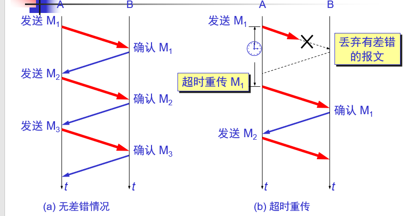
- 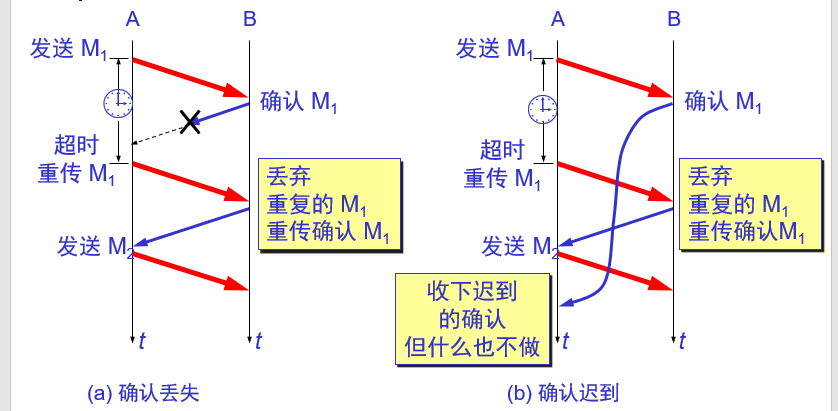

**可靠传输协议：自动重传请求ARQ**

- 接收方不需要请求发送方重传某个出错的分组，而是发送方自动重传某个可能出错的分组
- 当发送方在最后一个发送的分组之后，在设定的超时重传时间之内，没有收到确认，即进行重传
  - 该超时重传时间的设定应大于加权平均往返时间$RTT_s$
  - 加权平均往返时间：$RTT_s = (1-\alpha) \times RTT_{s-1} + \alpha \times RTT$

**上述ARQ协议信道利用率很低，实际使用的是流水线传输**

- 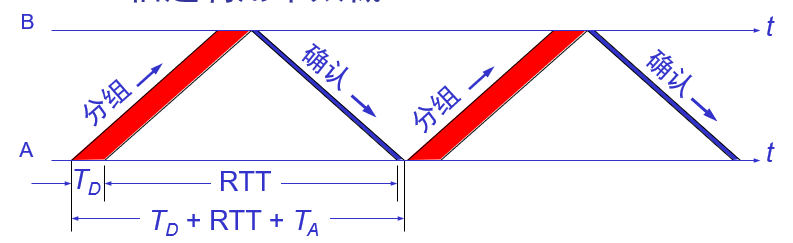
- 可以看到发送一个数据包的信道利用率为$\frac{T_0}{T_0+RTT+T_A}$，信道利用率很低
- 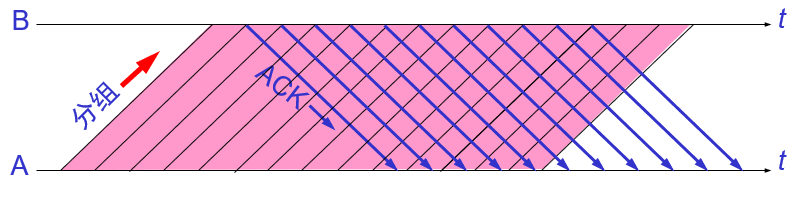
- 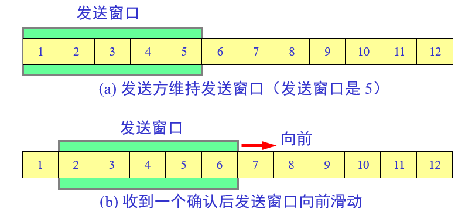
- 接收方采用 **累积确认**的方式，即不必对收到的每一个分组进行确认，而是对**按序到达的最后一个分组进行确认**，也就意味着：**到这个分组为止所有的分组已经正确收到**，因此这**很依赖于分组的编号**

### TCP报文格式

**TCP报文段的格式**

- 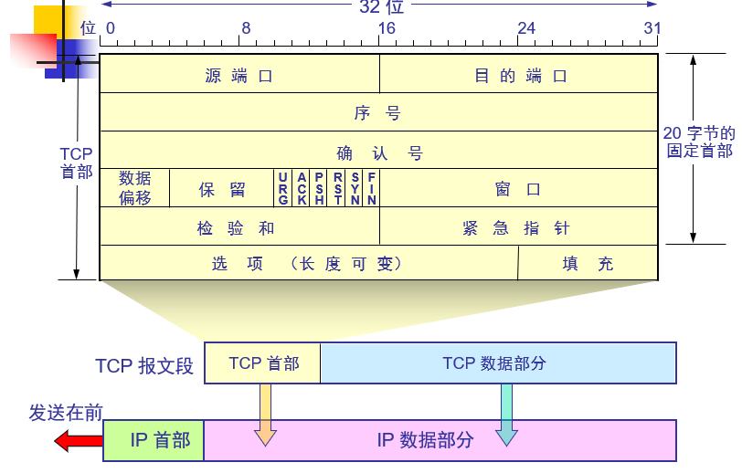
- **序号**：该分组的第一个字节是整个要传输文件的第几个字节
- **确认号**：下一个要发送分组的序号
- **数据偏移**：记录TCP报文段多少个字节之后是数据部分，4位，*4为最终的偏移
- URG：标志为1，发送端优先发送该分组
- ACK：标志为1，确认号有效
- SYN：同步时使用
  - 当一个客户端访问web服务器时，首先需要建立连接，那么在最开始建立会话时，发送的两个分组
    1. 客户端--》 服务器 序号 0，确认号0，ACK 0，SYN 1
    2. 服务器--》客户端  序号0，确认号1，ACK 1， SYN 1
  - 当建立了会话时，后续发送的分组SYN=0
- PSH：接收端优先读取该分组
- FIN：TCP 数据传送完毕，释放连接
- **窗口**：假设有A服务器，B客户端，那么首先B向A建立连接，会告诉A自己的接收缓存，A根据该接收缓存设置自己的发送缓存，同时A也会告诉B自己的接收缓存，B根据该接收缓存设置自己的发送缓存，也就是**这里的窗口其实是接收缓存**
  - 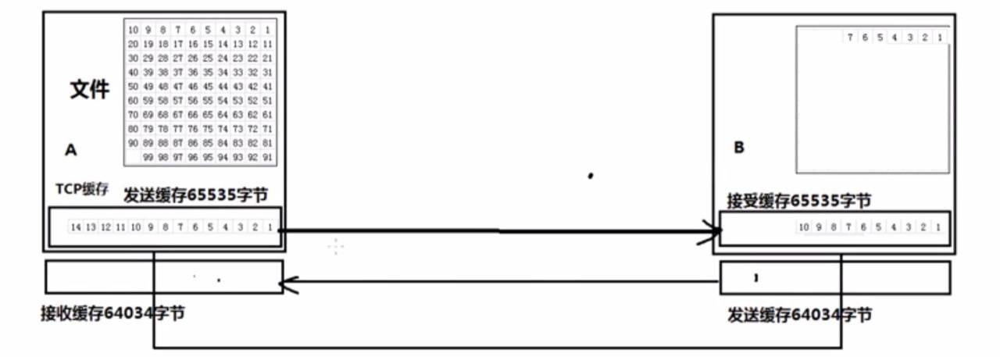
- **校验和**：和UDP校验同理，加上伪首部进行**校验首部+数据部分**是否出错，若有差错，则丢弃

**一个TCP通信报文的例子**

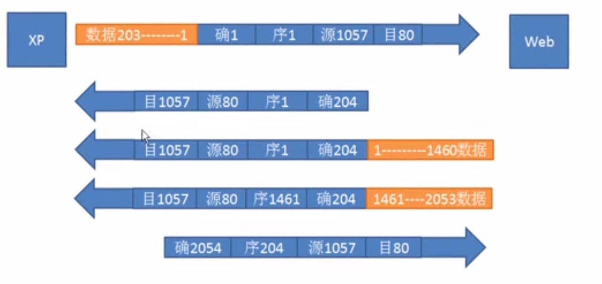

- 从上面这张图可以分析出流水线传输，累积确认的做法
- 以及确认号确认的是什么，确认的是目的地址下一次要发的分组序号
- 而且也可以看出是全双工通信

### 拥塞控制

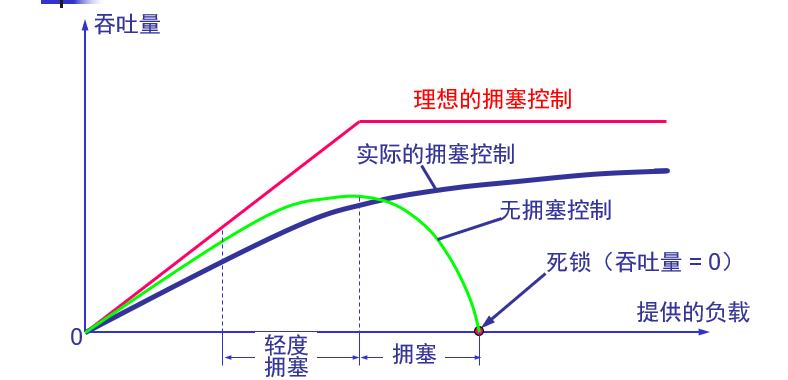

**慢开始和拥塞避免**

- 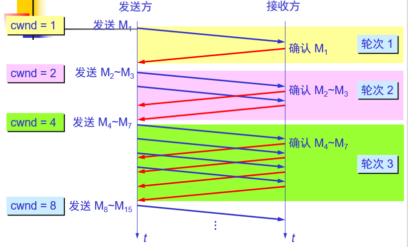
- 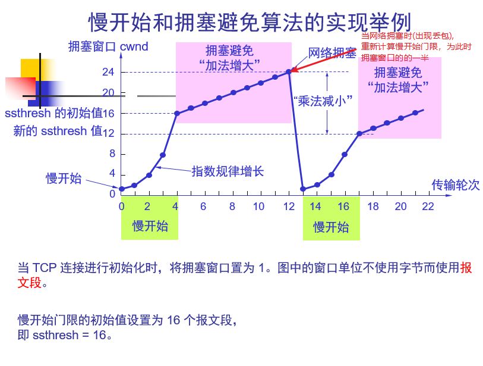

**快重传**

- 接收方每收到一个失序的报文段后就立即发出重复确认。
- 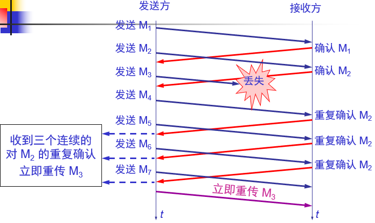
- 一般情况下，累积确认会在收到M5之后，给发送方发一个确认号为3的分组，表明成功接收到M1和M2，没有接收到M3，要求发送方重传M3，M4，M5
- 同样，还有一种选择重传，在收到M5之后，只会要求发送方重传M3，不需要重传M4,M5，因为M4,M5接收成功

- 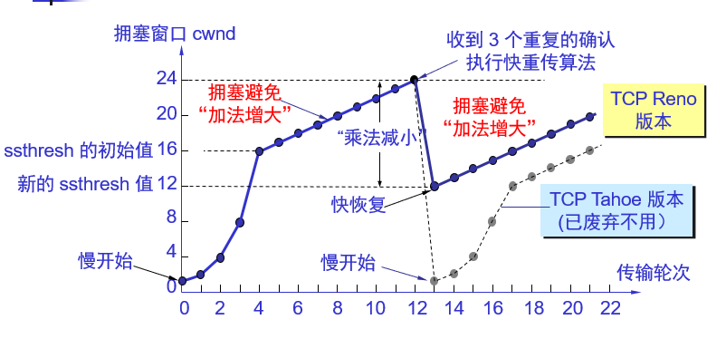

发送窗口  = Min[拥塞窗口，接收窗口]

### 传输连接管理

三个阶段

- 连接建立
- 数据传送
- 连接释放

**三次握手建立连接**

- 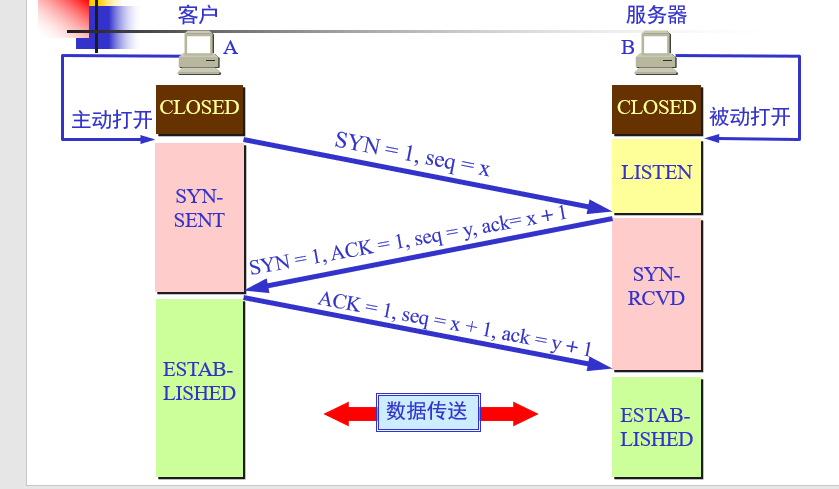

- seq 序列号  ack  确认号

**TCP 连接释放**

- 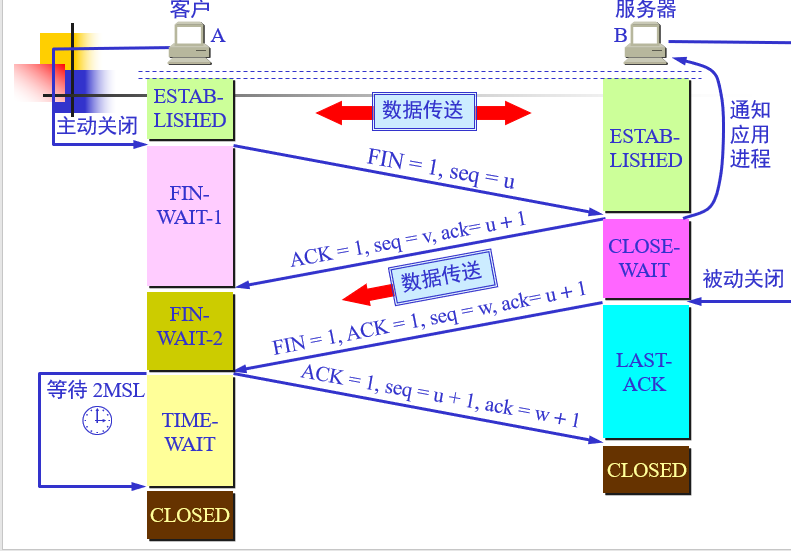