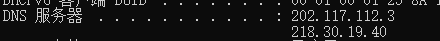
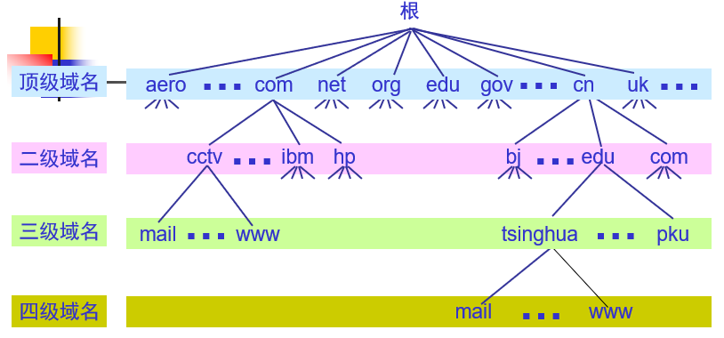
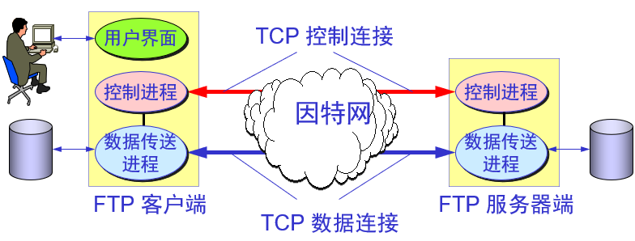

# 应用层

## 域名系统DNS

主机访问某个网站，首先向DNS服务器请求服务，将网站的域名解析为IP地址，返回该IP地址，主机收到IP地址后，访问该IP地址进而访问该网站

DNS 服务器有很多，可以查看主机的DNS服务器

- 
- 可以看到本机的DNS服务器分别是陕西教育网的DNS IP地址，以及陕西电信的DNS IP地址

## DHCP 协议

**动态主机配置协议**

- 需要 IP 地址的主机在启动时就向 DHCP 服务器广播发送发现报文（DHCPDISCOVER），这时该主机就成为 DHCP 客户。

- 本地网络上所有主机都能收到此广播报文，但只有 DHCP 服务器才回答此广播报文。

- DHCP 服务器先在其数据库中查找该计算机的配置信息。若找到，则返回找到的信息。若找不到，则从服务器的 IP 地址池(address pool)中取一个地址分配给该计算机。DHCP 服务器的回答报文叫做提供报文（DHCPOFFER）

一般分配的IP有租约的限制

## FTP协议

- 控制连接：标准端口为21，用于发送FTP命令信息，比如删除，重命名等
- 数据连接：标准端口为20，用于上传，下载数据
- 数据连接的建立类型
  - 主动模式：服务器从20端口向客户端指定的端口发起连接（客户端告服务器该端口）
  - 被动模式：服务器在指定范围的某个端口被动等待客户端发起连接

[一个端口同时做两件事](https://blog.csdn.net/weixin_30675247/article/details/95372728)