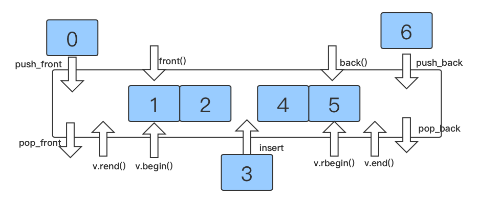

# STL

## STL的诞生

- 长久以来，软件界一直希望建立一种可重复利用的东西
- c++**面向对象和泛型编程**的思想，目的就是**复用性的提升**
- 大多数情况下，数据结构和算法都没有一套标准，导致被迫从事大量重复工作
- 为了建立数据结构和算法的一套标准，诞生了STL

## STL基本概念

- STL -> Standard Template LIbaray 标准模板库
- STL 从广义上分为
  - **容器 container**
  - **算法 algorithm**
  - **迭代器 iterator**

- 容器和算法之间通过迭代器进行无缝连接
- STL 几乎所有的代码都采用了**模板类或者模板函数**


## STL 六大组件

- **容器**：各种数据结构，如vector，list，deque，set，map等，用来存放数据
- **算法**：各种常用的算法，如sort，find，copy，for_each等
- **迭代器**：扮演了容器与算法之间的胶合剂
- **仿函数**：行为类似函数，可作为算法的某种策略
- **适配器/配接器**：一种用来修饰容器或者仿函数或迭代器接口的东西
- **空间配置器**：负责空间的配置与管理


## STL 容器，算法，迭代器

STL 容器将**运用最广泛的一些数据结构**实现出来

- 比如：数组，链表，栈，队列，集合，数，映射表等等

容器一般分为两种

- **序列式容器**：强调值的排序，序列式容器的每个元素都有固定的位置
- **关联式容器**：二叉树结构，各元素之间没有严格的物理上的顺序关系


算法一般分为两种

- **质变算法**：运算过程中会更改容器中的元素的内容，比如拷贝，替换，删除等
- **非质变算法**：运算过程中不会更改容器中的元素的内容，比如查找，计数，遍历等等


迭代器：提供一种方法，使之能够依序寻访某个容器包含的各个元素，而又无需暴露该容器的内部表达式。

- **每个容器都有自己专属的迭代器**
- 迭代器使用非常类似指针

| 种类           | 支持运算                         | 功能                                                     |
| -------------- | -------------------------------- | -------------------------------------------------------- |
| 输入迭代器     | 只读，支持++，==，!=             | 对数据的只读访问                                         |
| 输出迭代器     | 只写，支持++                     | 对数据的只写访问                                         |
| 前向迭代器     | 读写，支持++,==,!=               | 读写操作，并能向前推进迭代器                             |
| 双向迭代器     | 读写，支持++,--                  | 读写操作，并能向前和向后操作                             |
| 随机访问迭代器 | 读写，支持++,--,[n],-n,<,<=,>,>= | 读写操作，可以以跳跃的方式访问任意数据，功能最强的迭代器 |

- 常用的迭代器有双向迭代器和随机访问迭代器


## 容器算法迭代器初识

- **建立容器，遍历容器**

  - ```c++
    #include <vector>
    #include <algorithm>
    
    
    void print(int value){
        cout << value << endl;
    }
    int main(){
        // 建立容器
        vector<int> v;
        // push
        v.push_back(10);
        v.push_back(20);
        // 起始迭代器，指向容器中的第一个元素
        vector<int>::iterator itBegin = v.begin();
        // 结束迭代器，指向容器中最后一个元素的下一个位置
        vector<int>::iterator itEnd = v.end();
    
        // 遍历容器：方法一
        while(itBegin != itEnd){
            cout << *itBegin << endl;
            itBegin ++;
        }
        // 遍历容器：方法二
        for (vector<int>::iterator it = v.begin();it!=v.end();it++){
            cout << *it << endl;
        }
        // 遍历容器：方法三，遍历算法
        for_each(v.begin(),v.end(),print);
        return 0;
    }
    ```

    

- **建立自定义容器**

  - ```c++
    class Person{
    public:
        int age;
        string name;
        Person(string name,int age){
            this->age = age;
            this->name = name;
        }
    };
    
    
    int main(){
      
        vector<Person> v1;
        v1.push_back(Person("tom",3));
        v1.push_back(Person("jack",10));
        for (vector<Person>::iterator it=v1.begin();it!=v1.end();it++){
            cout << it->name << " " << it->age << endl;
        }
    
        vector<Person *> v2;
        Person p0 = Person("tom",3);
        Person p1 = Person("jack",10);
        v2.push_back(&p0);
        v2.push_back(&p1);
        for (vector<Person *>::iterator it=v2.begin();it!=v2.end();it++){
            cout << (*it)->name << " " << (*it)->age << endl;
        }
    
        return 0;
    }
    ```

- **容器嵌套容器**

  - ```c++
    int main(){
        vector<vector <int>> v;
        vector <int> v1;
        vector <int> v2;
        vector <int> v3;
        vector <int> v4;
        for (int i=0;i<5;i++){
            v1.push_back(i);
            v2.push_back(i+1);
            v3.push_back(i+2);
            v4.push_back(i+4);
        }
        v.push_back(v1);
        v.push_back(v2);
        v.push_back(v3);
        v.push_back(v4);
        for (vector<vector<int>>::iterator it = v.begin();it!=v.end();it++){
            for (vector <int> ::iterator it2=(*it).begin();it2!=(*it).end();it2++){
                cout <<(*it2)<< endl;
            }
        }
        
    
        return 0;
    }
    ```

    


## string 类

- `string` 是 c++风格的字符串，而`string`本质上是一个类
- `string ` 和` char* `的区别
  - `char *` 是一个指针，char * 就是单独定义一个字符串，比如`"hello"`
  - string 是一个类，类内部封装了char*，string类往往需要利用char *去构造
- string 类内部封装了很多成员方法，比如查找，拷贝，删除，插入等
  - string 负责管理char *所分配的内存，不用担心复制越界和取值越界等，由类内部进行负责

- `#include <string>`


### 构造函数

- `string() ` 创建一个空的字符串，例如：string str
- `string(const char* s) `  使用字符串s初始化
- `string(const string& str)`  拷贝构造
- `string(int n, char c)`    使用n个字符c初始化

```c++
 //string()
 string s1;
 // string(const char* s)
 string s2 = string("nihao");
 //string(const string& str)
 string s3 = string(s2);
 //string(int n, char c)
 string s4 = string(5, 'h');
```


### 赋值操作

- `string& operator=(const char* s)`  char* 类型的字符串赋值给当前的字符串
- `string& operator=(const string &s)`   把字符串s赋给当前的字符串
- `string& operator=(char c)`  字符赋给当前的字符串
- `string& assign(const char *s)` 把char* 类型的字符串s赋给当前的字符串
- `string& assign(const char *s,int n)` 把char* 类型的字符串s的前n个字符赋给当前的字符串
- `string& assign(const string &s)`    把字符串s赋给当前的字符串
- `string& assign(int n, char c)`  用n个字符c赋给当前字符串


### 字符串拼接

- `string& operator+=(const char* s)`
- `string& operator=(const string &s)`
- `string& operator=(char c)`
- `string& append(const char *s)`
- `string& append(const char *s, int n)` 把char* 类型的字符串s的前n个字符拼接到当前字符串之后
- `string& assign(const string &s)`
- `string& assign(const string &s, int pos, int n)` 从哪个位置开始截取，截取几个字符串


### string 查找和替换

- `int find(const string& str, int pos=0)`  查找str第一次出现位置，从pos开始查找
- `int find(const char* s, int pos=0)`   查找s第一次出现的位置，从pos开始查找

- `int find(const char* s, int pos, int n)` 从pos位置查找s的前n个字符第一次出现的位置
- `int find(const char c, int pos=0)`查找字符c第一次出现的位置
- `int rfind(const string& str, int pos=0)`  查找str最后一次出现位置，从pos开始查找
- `int rfind(const char* s, int pos=0)`   查找s最后一次出现的位置，从pos开始查找
- `int rfind(const char* s, int pos, int n)` 从pos位置查找s的前n个字符最后一次出现的位置

- `int rfind(const char c, int pos=0)`查找字符c最后一次出现的位置
- `string& replace(int pos, int n, const string& str) ` 替换从pos开始n个字符为字符串str
- `string& replace(int pos, int n, const char* s)`替换从pos开始的n个字符为字符串s

### string 字符串比较

- 按照字符的ASCII码进行比较，主要用来判断字符串是否相等
- `int compare(const string &s)`  与字符串s比较，相等返回0
- `int compare(const char *s)`  与字符串s比较，相等返回0


### string 字符存取

- 通过[] 来访问或者修改单个字符
- 通过at 方式来访问或者修改单个字符

```c++
string s1 = "nihao";
// 通过[] 来访问单个字符
for (int i=0; i <5; i++){
  cout << s1[i] << endl;
}
//通过at 方式来访问单个字符
for (int i=0; i< 5; i++){
  cout <<s1.at(i) << endl;
}
// 通过[] 来修改单个字符
for (int i=0; i <5; i++){
  s1[i] = 'h';
}
cout << s1<< endl;
```


### 字符串插入和删除

- 插入字符串
  - `string& insert(int pos, const char* s)`  在pos处插入字符串s
  - `string& insert(int pos, const string& str)  `  在pos处插入字符串str
  - `string& insert(int pos, int n, char c) ` 在pos处插入n个字符c
- 删除字符串
  - `string& erase(int pos, int n=npos)   `  删除从pos开始的n个字符


### string 子串

- 从一个字符串中截取一部分作为另一个字符串
- `string substr(int pos=0, int n = npos)`   返回从pos开始的n个字符组成的字符串


# vector 容器

- vector与数组的区别
  - 普通数组是静态的，而vector可以**动态扩展**
- **动态扩展**：**并不是在原空间之后续接空间，而是找一个更大的空间，然后将原数据拷贝到新空间，释放原空间**

- vector 容器的迭代器是支持随机访问的迭代器
- 

### 构造函数

- `vector<T> v`   默认构造，无参构造 

- `vector<T>(v.begin(),v.end()) `  将v[begin(),end()) 区间中的元素拷贝给本身，v.begin()和v.end()是迭代器

- `vector<T>(int n, T elem)`   构造函数将n个elem拷贝给本身

- `vector<T>(vector<T> & v)`   无参构造

- ```c++
  //vector<T> v
  vector<int> v1;
  for (int i =0; i< 10; i++){
  v1.push_back(i);
  }
  //vector<T>(v.begin(),v.end())
  vector v2 = vector<int>(v1.begin(),v1.end());
  //vector<T>(int n, T elem)
  vector v3 = vector<int>(10,5);
  //vector<T>(vector<T> & v)
  vector v4 = vector<int>(v3);
  ```

  

### 赋值操作

- `vector& operator=(const vector &vec)`

- `void assign(begin,end)`

- `void assign(n,elem)`

- ```c++
  vector<int> v1;
  for (int i =0; i< 10; i++){
    v1.push_back(i);
  }
  vector<int> v2;
  //vector& operator=(const vector &vec)
  v2 = v1;
  vector<int> v3;
  //void assign(begin,end)
  v3.assign(v1.begin(),v1.end());
  vector <int> v4;
  //void assign(n,elem)
  v4.assign(5,10);
  ```

  

### vector 容量和大小

- `empty()` 判断容器是否为空
- `capacity()`    容器的容量
- `size()`  返回容器中元素的个数
- `resize(int num)`重新制定容器的长度为num
  - 若容器变长，则以默认值填充新位置
  - 若容器变短，则末尾超出长度的元素被删除 
- `resize(int num, T elem)`重新指定容器的长度为num
  - 若容器变长，则以elem值填充新位置
  - 若容器变短，则末尾超出容器长度的元素被删除

```c++
vector<int> v1;
//empty()
cout << "v1 是否为空:" << v1.empty() << endl;
for (int i =0; i< 10; i++){
v1.push_back(i);
}
//capacity()
cout << "v1的容量：" << v1.capacity() <<endl;
//resize(int num)
v1.resize(5);
print(v1);
// resize(int num, T elem)
v1.resize(15,3);
print(v1);

输出:
v1 是否为空:1
v1的容量：16
0 1 2 3 4 
0 1 2 3 4 3 3 3 3 3 3 3 3 3 3 
```


### vector 插入和删除

- `push_back(T elem)`  尾部插入元素 elem
- `pop_back()`   删除最后一个元素
- `insert(const_iterator pos,  T elem)`  迭代器指向位置pos插入元素elem
  - `const_iterator`只读迭代器   定义只读迭代器 `vector<T>::const_iterator it`
  - 通常如果传入的参数时只读的vector(deque,...等等)，函数内部的迭代器需要是只读迭代器
- `insert(const_iterator pos,  int count, T elem)`  迭代器指向位置插入count个元素elem
- `erase(const_iterator pos) ` 删除迭代器指向的元素
- `erase(const_iterator start, const_iterator end) `  删除迭代器从start到end之间的元素，相当于`clear()`
- `clear()`   删除容器中所有的元素

```c++
vector<int> v1;
for (int i =0; i< 10; i++){
v1.push_back(i);
}
cout << "origin:"<<endl;
print(v1);
v1.pop_back();
cout << "after pop_back:" << endl;
print(v1);
vector<int>::iterator it = v1.begin();
for (int i=0;i<3;i++){
it++;
}
v1.insert(it, 11);
cout << "after insert:" << endl;
print(v1);
v1.erase(it);
cout << "after erase:" << endl;
print(v1);
cout << "after insert:" << endl;
v1.insert(it,3,12);
print(v1);
cout << "after erase:" << endl;
v1.erase(it,v1.end());
print(v1); 
```


### vectot 数据存取

- `at(int idx)` 返回索引为idx所指的数据
- `operator[]` 返回索引为idx所指的数据
- `front()`  返回容器中第一个数据元素
- `back() `  返回容器中最后一个数据元素

```c++
vector<int> v1;

for (int i =0; i< 10; i++){
v1.push_back(i);
}
for (int i=0;i<10;i++){
cout << v1[i] << " ";

}
cout << endl;
for (int i=0;i<10;i++){
cout << v1.at(i) << " ";
}
cout << endl;
cout << v1.front() << endl;
cout << v1.back() << endl;

输出：
0 1 2 3 4 5 6 7 8 9 
0 1 2 3 4 5 6 7 8 9 
0
9
```


### vector 互换容器

- `swap(vector &vec)`  实现两个容器的互换
- 实际用途
  - `vector<T>(v).swap(v)`可以收缩内存，创建了一个大的vector(eg:len = 100000) ，当resize到小长度时，其capacity不会变化，仍然很大

### vector 预留空间

- `reserve(int len) `容器预留len个元素长度，预留位置不初始化，不可访问，写入元素后可以访问


## deque 容器



- 双端数组，可以对头端进行插入和删除
- 内部工作原理
  - 内部有一个中控器，维护每段缓冲区中的内容，缓冲区中存放真实数据
  - 中控器维护的是每个缓冲区的地址，使得使用deque时像一片连续的内存空间
  - 读取时相比于vector更慢
- deque 容器的迭代器是支持随机访问的迭代器


### deque 构造函数

- `deque<T> v`   默认构造，无参构造 

- `deque<T>(d.begin(),d.end()) `  将v[begin(),end()) 区间中的元素拷贝给本身，d.begin()和d.end()是迭代器
- `deque<T>(int n, T elem)`   构造函数将n个elem拷贝给本身
- `deque<T>(vector<T> & v)`   无参构造


### deque 赋值操作

- `vector& operator=(const deque &deq)`
- `void assign(begin,end)`
- `void assign(n,elem)`


### deque 大小操作

- `deque.empty()` 是否为空
- `deque.size() ` 容器中元素的个数
- `deque.resize(int num)`重新制定容器的长度为num
  - 若容器变长，则以默认值填充新位置
  - 若容器变短，则末尾超出长度的元素被删除 
- `deque.resize(int num, T elem)`重新指定容器的长度为num
  - 若容器变长，则以elem值填充新位置
  - 若容器变短，则末尾超出容器长度的元素被删除

- **没有容量的概念**


### deque 插入和删除

- 两端操作
  - `deque.push_back(T elem) `   尾插
  - `deque.push_front(T elem) ` 头插
  - `deque.pop_back() ` 尾删
  - `deque.pop_front() ` 头删
- 指定位置操作
  - `deque.insert(const_iterator pos,  T elem)`  迭代器指向位置pos插入元素elem
    - `const_iterator`只读迭代器   定义只读迭代器 `vector<T>::const_iterator it`
    - 通常如果传入的参数时只读的vector(deque,...等等)，函数内部的迭代器需要是只读迭代器
  - `deque.insert(const_iterator pos,  int count, T elem)`  迭代器指向位置插入count个元素elem
  - `deque.insert(const_iterator pos, beg, end)`  在pos位置插入[beg,end)区间的数据
  - `deque.erase(const_iterator pos) ` 删除迭代器指向的元素
  - `deque.erase(const_iterator start, const_iterator end) `  删除迭代器从start到end之间的元素，相当于`clear()`
  - `deque.clear()`   删除容器中所有的元素

### deque 数据存取

- 同vector

