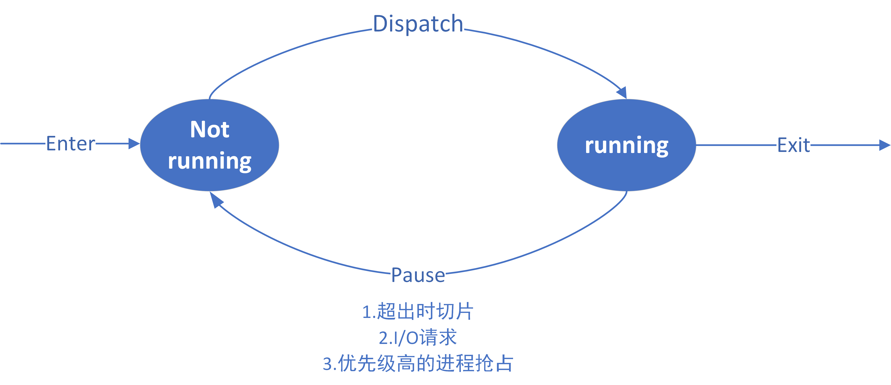
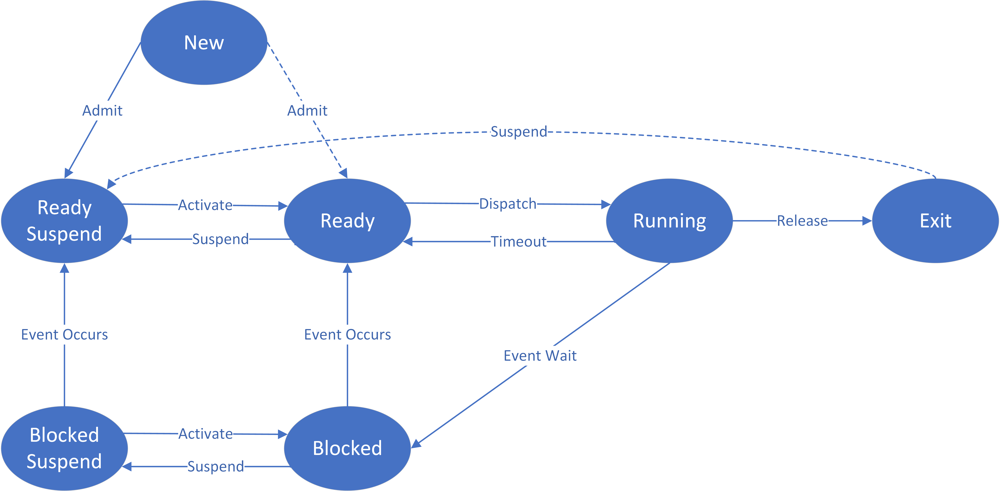

进程描述与控制

# 进程的定义

- 什么是进程
  - 正在执行的程序
- 进程的三个要素
  - 可独立调度的执行单元
  - 与代码相关的数据集
  - 执行时的上下文（进程状态）

## 进程与程序

- 进程与程序的联系
  - 程序是产生进程的基础
  - 程序的每次成功运行构成不同的进程
  - 进程是程序功能的体现
  - 程序是类，进程是实例的对象，一个类每次实例化产生不同的对象
  - 代码，程序，进程类比docker file，container，image
    - 代码编译为可执行文件也就是程序，程序运行产生进程
    - docker file `build`产生image，image `run` 产生container，同时container会保存其运行状态
- 进程与程序的区别
  - 进程是动态的，程序是静态的
  - 进程是暂时的，程序是永久的
  - 进程的组成包括程序、数据和进程控制块

## 进程映像

**也就是一个进程以何种结构如何存储在（虚拟）内存中**

- 可执行的程序和数据
- 系统栈
- 进程控制块
  - 进程标识符
    - 进程ID、父进程ID、用户ID
  - 处理器状态信息
  - 进程控制信息

## 进程的特点

- 独立性
- 动态性：进程是动态的
- 并发性：宏观上的并行（分时系统）

# 进程状态

- **两状态进程模型**
  - 运行状态（running）：使用处理器
  - 非运行状态（not running）：不使用处理器
  - 
- **五状态进程模型**
  - New：申请资源，也就是申请主存空间用于存放进程
  - Ready：进程已经创建好，分配到相应的空间，分配到处理器即可运行
  - Running：正在运行，使用处理器
  - Blocked：由于I/O请求等事件，需要等待事件的响应才可以执行下一步
  - Exit：进程结束
  - *注：只有进程从Running到Blocked这一步是程序可以控制的，其余都是操作系统在控制*
  - 
  - **可以引申为队列**
    - Ready Queue：所有处于Ready状态的进程组成Ready Queue，由操作系统通过调度算法选择一个进程转为Running
    - Blocked Queue：所有处于Blocked状态的进程组成Blocked Queue
      - 多Blocked  Queue：等待相同事件响应的Blocked 进程组成一个Blocked Queue，进而等待不同事件响应的进程组成不同的Blocked Queue
    - 队列的链表结构
- **具有挂起状态的进程模型**
  - 为什么需要挂起状态
    - 相当于变相扩大了主存的空间，可以处理更多的进程
  - 挂起状态：进程从主存移动到外存
    - 阻塞挂起
    - 就绪挂起
  - 唤醒：将进程从外存移动到主存
    - 优先唤醒就绪挂起
  - 

# 进程的生命周期

- **进程创建**
  - 操作系统提供接口函数，由操作系统完成进程的创建
  - 分配进程的标识（唯一性）
  - 分配进程的内存空间（进程映像）
    - Ready 状态：在主存中分配内存空间
    - Ready Suspend：在外存中分配内存空间
  - 初始化进程控制块
  - 设置正确的连接----》Ready Queue
  - 创建或扩展其它数据结构
- **进程终止**
  - 正常退出（主动）
  - 异常退出（主动）
  - 错误退出（被动）
    - eg：C语言中内存溢出等
  - 外界干预（被动）
- **进程切换**
  - 一个正在Running的进程转移为其他状态，另一个处于Ready状态的进程转为Running
  - 什么时候进行切换
    - 时间片完  Running ---》Ready
    - I/O中断  
    - 存储器访问错误
    - 系统调用（调用系统函数）
    - 陷阱（程序报error）

## 模式切换

- 用户模式（非特权模式）
  - 用户发起的进程默认在非特权模式下进行
- 内核模式（特权模式）
  - 可以执行特权指令，访问操作系统的内存空间
- 什么时候进行切换（一进一出，非特权模式进入特权模式，之后特权模式要返回非特权模式）
  - I/O中断请求 / 中断返回
  - 存储器访问错误 / 处理结束
  - 陷阱 / 处理结束
  - 系统调用 / 调用返回
- 模式切换与进程切换的关系
  - 进程切换一定需要模式切换（调度程序）
  - 模式切换不一定会改变进程的状态