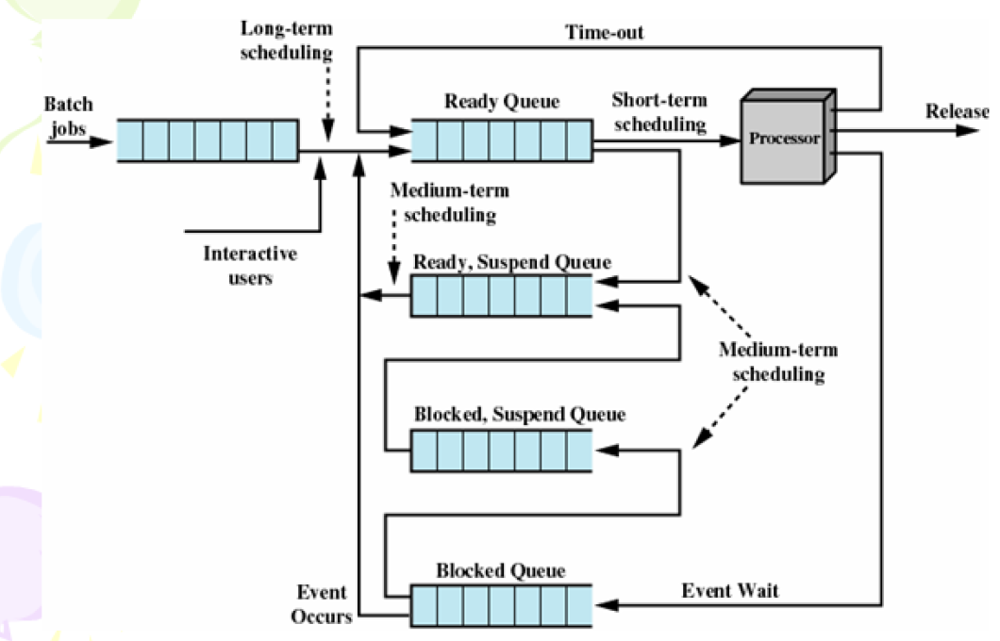
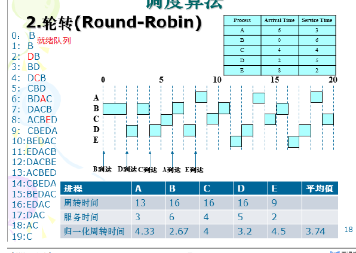
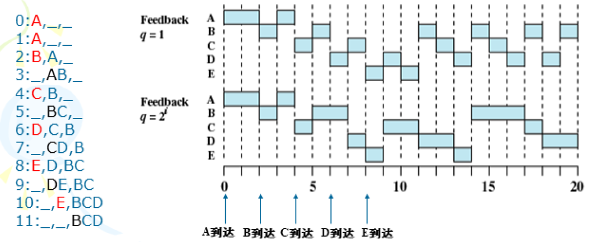

单处理器调度

# 处理器调度

- 处理器调度的概念
  - 决定进程状态的转换
  - 一般而言，处于不同状态的进程会组成一个队列，如就绪队列等，而调度的作用是从队列中选择哪个进程将其转入下一个状态，以实现某个goal。

- 短程调度、中程调度、长程调度的关系

  - short-term scheduler ：selects which process should be executed next and **allocates CPU**
  - medium-term scheduler : selects which process should be **brought into the ready queue**
  - long-term scheduler : **removes processes from memory** (and from active contention for the CPU)

  -     

# 短程调度

- $T_w$ ：进程到来到开始服务花费的等待时间
- $T_e$：进程到现在为止花费的执行时间
- $T_s$：进程所需要的总服务时间
- $T_r$：周转时间 $T_r = T_w+T_s$
  - 归一化周转时间 $\frac{T_r}{T_s}$，最小值为1

- 决策模式
  - 抢占：让进程运行直到结束或阻塞的调度方式  
  - 非抢占：允许将逻辑上可继续运行的在运行过程暂停的调度方式

# 先来先服务(FCFS)

- 先到到的进程先服务
- 选择函数：$max(T_w)$
- 决策模式：非抢占
- 优点：实现方法简单
- 缺点（主要由于进程的到达顺序不一定导致）
  - 平均周转时间波动较短
  - 公平性较差，短进程可能等待时间较长
  - 更有利于处理器密集型的进程
- 结合优先级策略
  - 设置不同优先级的Ready 队列，高优先级优先服务
  - 为预防低优先级的进程饥饿，动态调整优先级

# 轮转（Round-Robin)

- 选择函数：常数
- 决策模式：抢占
- 思想
  - 新到的进程存放于就绪队列队尾
  - 被抢占的进程存放于就绪队列队尾（新到的进程之后）
  - 就绪队列仍然按照先到先服务进行轮转
-  缺点
  - 发生进程切换的次数多
  - 时间片设置太大，等待时间过长，极限情况下退化为FCFS
  - 时间片设置太小，上下文切换频繁

- 虚拟轮转（类比于FCFS的优先级策略）
  - 轮转策略中的就绪队列分为就绪队列和附加就绪队列
  - 附加就绪队列的优先级高于就绪队列
  - 附加就绪队列进程的执行时间时该进程上次时间片的剩余时间
- 

# 最短进程优先(SPN)

- 选择函数：$min(T_s)$
- 决策模式：非抢占

- 思想
  - 当一个进程结束后，选择就绪队列中总服务时间最短的进程进行服务
- 优点
  - 平均周转时间小
- 缺点
  - 长进程可能会出现饥饿
  - 需要预估进程的总服务时间

# 最短剩余时间优先(SRT)

- 选择函数：$min(T_s-T_e)$
- 决策模式：抢占
- 思想
  - 每当一个进程到来时，比较当前进程与到来进程的剩余服务时间，剩余服务时间更短的进程进行服务(Running)，另一个转为就绪状态
  - 当一个进程结束/阻塞时，如没有新的进程到来，从就绪状态队列中选择一个剩余时间最短的进程进行服务(Running)
- 优点
  - 短进程有利
- 缺点
  - 长进程可能会出现饥饿

# 最高响应比优先(HRRN)

- 选择函数：$max[(T_w+T_s)/T_s]=max(T_r/T_s)$
- 决策模式：非抢占
- 思想
  - 每当一个进程结束/阻塞时，从就绪状态队列中选择最高响应比的进程进行服务
- 优点
  - 短进程有利，防止无限期推迟
- 缺点
  - 需要预估总服务时间

# 反馈

- 思想
  - 设置了多个不同优先级的就绪队列，并赋予各个队列大小不同的时间片，使优先级越高的时间片越小。
  - **新就绪的进程总是进入最高优先级队列的队尾**，并按 FCFS 原则等待调度；**当轮到该进程执行时，若它能在规定的时间片内完成，便可准备撤离系统，否则将他转入第二级队列末尾，再同样按 FCFS 原则等待调度；如果它在第二级队列上运行一个时间片后仍未完成，再依次将它转入第三级队列**，……，如此下去，当一个长作业从第一级队列降到最后一级队列时，便在该队列（最后一级队列）中采取 RR （轮转）算法运行。
  - **系统总是调度第一级队列中的进程执行，仅当第一级队列空时，才调度第二级上队列上的进程执行。**以此类推，仅当第 1~（i - 1）级队列空时，才调度第 i 级队列上的程序执行。
- 

