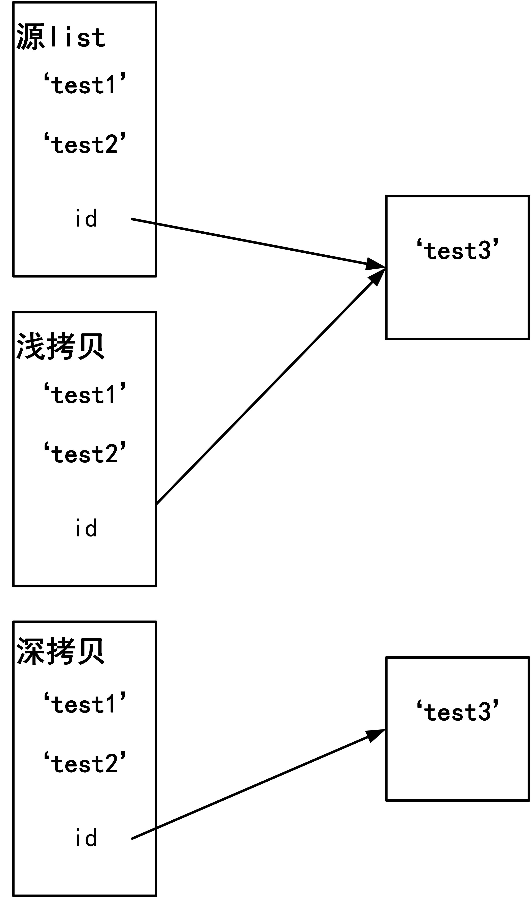
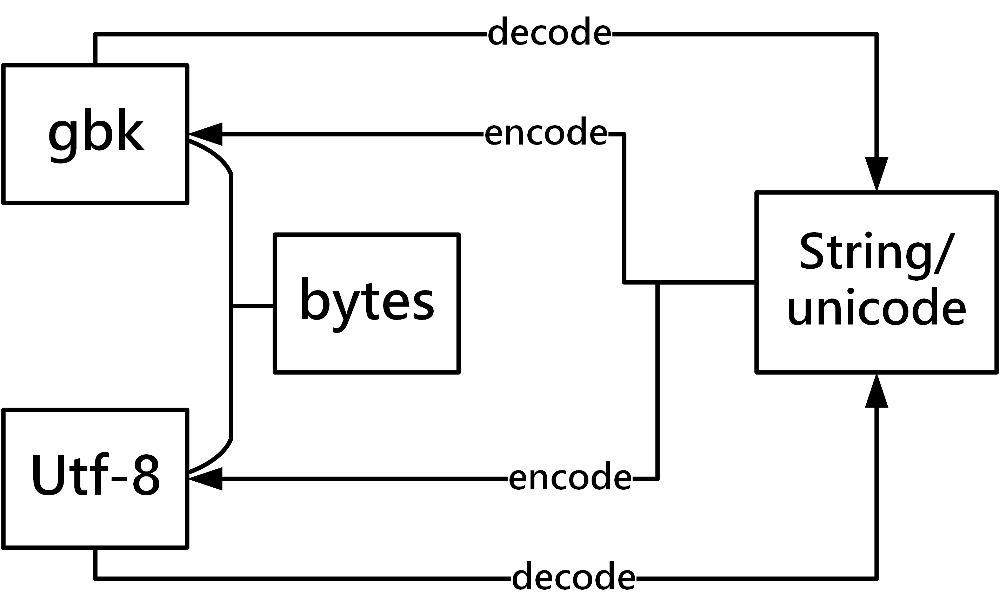

# 前引

- **解释型 VS 编译型**
  - 解释型语言：边执行边翻译，因此执行的时候需要解释器
    - 优点：跨平台可移植性强，在这里主要指跨硬件平台，不同的cpu执行不同的指令集，指令集也就相当于要翻译成的机器语言。目前有复杂指令集（intel，amd）和精简指令集（ARM）
    - 缺点：执行速度慢
  - 编译型：代码一次性翻译为机器语言，之后执行的时候不需要解释器
    - 优点：执行速度快
    - 缺点：跨平台可移植性差，在复杂指令集平台上编译得到的程序无法再精简指令集平台上运行
- **弱类型 VS 强类型**
  - 弱类型：变量的值的类型可以发生转换，比如C语言中int与float相加，可以强制将int转换为float进行相加
  - 强类型：变量的值的类型不可以发生转换
- **动态类型 VS 静态类型**
  - 动态类型：变量的类型可以发生变换，在定义变量的时候不需要指定变量的类型，比如由int转为dict
  - 静态类型：变量的类型不可以发生转换，在定义变量的时候需要同时定义变量的类型
- **Python 面向对象，动态，强类型，       解释型**
- python的缺点
  - 速度慢
  - 保密性差
  - 线程不能利用多核

# python 基础

## 变量命名

- 最基本的**先定义后调用**
- 命名规则
  - 字母、数字、下划线的任意组合
  - 不能以数字开头
  - 不能与关键字冲突
- 常用定义方式
  - 驼峰体
  - 下划线（python 推荐）
- 其他
  - python 3.x 居然支持中文命名
  - 对于变量名太长的情况，通常采用缩写，这里注意一下有一些约定俗成的缩写：[编程常用缩写](https://blog.csdn.net/zhaoguanghui2012/article/details/51144156)
  - 常量命名：大写+下划线
- 注释
  - `""" """` 多行注释
  - ` ' ' `  单行注释

## 输入输出

- 输入：`input`，例：`name = input('your name is ')`，输入数据默认为字符串
- 输出：`print`

## 数据类型

- Number（不可变数据类型）
  - int（python 3.x 取消long）
  - float
  - bool
  - complex（复数）
- String（不可变数据类型）
- List（可变数据类型）
- Tuple（不可变数据类型）
- Set（可变数据类型）
- Dictionary（可变数据类型）
- object/对象（可变数据类型）

## 流程控制

- 单分支

  - ```python
    if 条件:
    	满足条件执行的代码
    ```
- 双分支

  - ```python
    if 条件:
        满足条件执行的代码
    else:
        不满足条件执行的代码
    ```

- 多分支

  - ```python
    if 条件:
        满足条件执行的代码
    elif 条件:
        满足条件执行的代码
    elif 条件:
        满足条件执行的代码
    ```
	  
	- 只要满足一个条件就不再往下执行

## 循环

- while循环
  - ```python
    while 判断条件:
        执行代码
    ```
    
  - ```python
    while 判断条件:
        执行代码
    # 当while循环正常退出时，执行else下的代码
    else:
        执行代码
    ```
- for 循环
  - ```Python
    for <variable> in <sequence>:
        <statements>
    else:
        <statements>
    ```

  - 通常用于遍历列表、字符串、字典等可以遍历的变量中的元素

- `break` ：彻底退出循环

- `continue`：终止当次循环

- `exit()`：退出程序
## 缩进

- 相比于其他语言，python使用强制缩进（tab）来区分代码块

- ```c
  /* c 语言使用{}来区分子级代码*/
  if (3>2){
      printf('yes')
  }
  ```

- ```python
  # python 使用强制缩进（tab）来区分子级代码
  if 3>2:
      print('yes')
  ```

- 顶级代码必须顶行写

- 同一级别的代码，缩进必须一致

  

## 变量创建与垃圾回收

- `id(obj)`	获取对象的内存地址

- **“一切皆为对象，一切皆为对象的引用”**
  - 对象：内存空间中存储的数据
  - 变量：指向对象的指针
  
- 对于**不可变数据类型**
  - 修改obj的value实际上会开辟一块新的内存空间用于存放修改为的value，并将该变量指向这块新的内存空间。
  
  - python解释器的垃圾回收机制会定期回收没有变量指向的内存空间
  
  - ```python
    # 当修改了a的值后，开辟了一块新的内存空间('test2')，a指向这块新的内存空间('test2')
    # 但是b仍然指向原内存空间('test')
    >>> a = 'test'
    >>> b = a
    >>> a = 'test2'
    >>> b
    'test'
    ```
  
- 对于**可变数据类型**
  
  - 修改obj的value（增、删、改、查）不需要申请新的内存空间，只需要在原内存空间内修改，内存地址会保持不变，但是内存区域大小会改变
  
  - ```python
    # 通过b修改该内存空间，不会导致b指向一块新的内存空间，而是原内存空间直接修改
    # 因此a和b仍然指向的是同一块内存空间，也就导致了修改了b,a同时发生修改
    >>> a = ['test1','test2']
    >>> b = a
    >>> b[0]='test3'
    >>> a
    ['test3', 'test2']
    >>>for i in a:
      i [0] = 'm'
    >>> a
    >>>['mest1','mest2']
    ```
    
  - **浅拷贝**  `obj.copy()`
  
    - 浅拷贝只会拷贝第一层数据
  
  - **深拷贝**  
  
    - ```python
      import copy
      obj_2 = copy.deepcopy(obj_1)
      ```
  
    - ```python
      >>> a = ['test1','test2',['test3']]
      >>> a_copy = copy.copy(a)
      >>> a_deepcopy = copy.deepcopy(a)
      >>> a_deepcopy[2].append('test4')
      >>> a
      ['test1', 'test2', ['test3']]
      >>> a_deepcopy
      ['test1', 'test2', ['test3', 'test4']]
      >>> a_copy[2].append('test5')
      >>> a
      ['test1', 'test2', ['test3', 'test5']]
      >>> a_copy
      ['test1', 'test2', ['test3', 'test5']]
      ```

      
  
  - 
  
- **引申到变量的删除**
  
  - `del valiable`  删除的只是变量，也就是指针，不一定会释放指向的内存空间，只有当对内存空间（对象）的引用为0时，内存空间才会释放

## 身份运算

- `type(obj)`：查看变量数据类型
  - 判断变量是否是某种数据类型，例`type(a) is int`	`type(a) is not int`
- `isinstance(obj,type)`   判断obj是否是某种数据类型   `isinstance('test',str)`
- `is`：`a is b`	等同于	`id(a) == id(b)`

- `is not` 同理
- `None`
  - 可以充当占位符，用于变量之后的赋值，`a is None`
  - 判断某个变量是否空：`if a is None`

## 三元运算

- `a = value_1 if 条件 else value_2`	如果条件成立a = value_1，条件不成立则a = value_2

# 编码

- **所谓的编码就是数据存到硬盘上，怎样转换为二进制**

  - *注意：这里讲的数据指的是字符串*

- **编码方案**

  - ASCII 码 ---> 规定了256个字符的表示，也就引申出了8个bit为1个byte来表示计算机中的基本字符。
  - GB2312编码表  ---> 存放了6763个汉字，用2个字节来表示一个汉字
  - GBK ---> 存放了280000多个字符（不仅仅包括汉字），同样用2个字节来表示一个字符
  - 其他国家的编码表，如日本的shift_JIS，韩国的KS.xxx等
  - Unicode ---> ISO 定义的一套用来解决不同编码规范冲突的编码表，采用两个字节来表示所有的字符
  - UTF-8 ----> 可以理解为不等长编码（Unicode是等长编码），采用1-4个字节来表示所有的字符
    - 英文字符占1个字节
    - 中文字符占3个字节

- python 3 默认采用utf-8编码

- python 2 采用ASCII编码

- 指定编码方案(文件开始)
  - `# coding utf-8`
  - `-*- encoding:utf-8 -*—`
  
- **字符的编解码**

  - `str.encode('utf-8/gbk')`   将数据编码为utf-8或者gbk，utf-8和gbk为bytes类型(16进制)

  - ```python
    >>>a = '你好'
    >>>type(a.encode('utf-8'))
    <class 'bytes'>
    >>>type(a.encode('gbk'))
    <class 'bytes'>
    >>>a_utf8 = a.encode('utf-8')
    >>>a_utf8.decode('utf8')
    '你好'
    ```

  - `str.decode('utf-8 or gbk')`   解码为unicode

  - 

- python执行代码的过程：

  - 解释器找到代码文件，把代码字符串按文件头定义的编码加载到内存，转成unicode
  - 把代码字符串按照语法规则进行解释，
  - 所有的变量字符都会以unicode编码声明

# Hash

- 将可变长度的输入映射为固定长度的输出
- 特点
  - 不可逆，不能通过输出来计算输入
  - 计算极快：计算复杂度不依赖于输入大小
  - 不同的输入可能得到相同的输出
- 应用
  - 密码：服务器存储的登陆密码并不是明文密码，而是明文密码经过Hash算法（md5算法）的输出
  - 文件完整性校验：文件发布时同时发布一个MD5值，对下载下来的文件经过Hash算法（md5算法）计算得到一个MD5值，判断二值是否一致来检验下载的文件是否完整
- Python中的hash
  - `hash(obj)`   obj必须为不可变数据类型，对输入的数据进行hash
  - dict查询速度极快也就是依赖于hash
    - 首先对输入的key通过hash计算得到一个hash值，每个key计算得到的hash值有序存放在一个列表中
    - 当进行查找时，对要查找的key通过hash计算得到一个hash值，之后通过二分法在列表中查找目的hash，也就找到了目的key
    - 当然带来的问题是插入的速度变慢，对于每个输入的key要计算hash，并重新排列hash列表
  - set同样也是利用hash
    - 对每个元素计算hash值

# 文件操作

- 文件打开模式

  - `r (read)`  
  - `w (write)`  不存在文件时，创建文件。存在文件时，覆盖原文件 不可读
  - `a (append)`  追加模式，不会覆盖原文件，在原文件末尾插入内容
  - `r+`  读写模式，可读可写，写入内容追加到文件末尾
  - 同理还有`a+` 以及`w+`，不常用，不再赘述
  - `wb`  二进制模式写入
  - 同理存在`rb`  和`ab` ,不再赘述

- 文件操作的三个步骤

  - 打开文件 `f = open(filename,mode='w/r/a',encoding='utf-8orgbk')`    

  - 操作文件（读、写）

    - ```python
      # 读文件
      f.read([size]) # 读取指定字节数，默认为读取所有字节
      f.readline() #读取整行（一行）
      f.readlines() #读取所有行，以列表的形式存放每行的数据
      ```

    - ```python
      # 写文件
      f.write(data)
      ```

  - 保存文件 `f.close()`

- 循环文件

  - ```python
    for line in f:
    	print(line)
    ```

- 注：在读文件的时候，注意光标的位置

  - `f.seek(offset,whence)` 移动光标，offset为移动几个字节，whence可选，默认为0表示文件的起始位置，11表示从当前文职算起，2表示从文件的末尾位置算起
  - `f.tell()`  返回当前光标的位置

- 注：直接修改文件内容时，注意覆盖问题。例：修改为的内容为3个字节，但是光标指向的字符占一个字节，此时就会覆盖之后的两个字节

- ```python
  '''
  原文件内容：
  test1
  test2
  '''
  # 光标在文件开始
  f.write('你')
  '''
  修改后文件内容：
  你t1
  test2
  '''
  ```

- **文件编码的问题**

  - 一个文件需要指定它的编码方式
  - open函数指定的encoding也就是以哪种编码方式打开文件，当打开该文件后，之后写入的数据同样以指定的编码方式编码，也就是python自动将数据编码后存入文件
  - 但是如果是wb模式，此时写入数据需要提前进行编码，同时不可以指定打开文件时的编码方式，因为此时存入的数据直接以二进制形式存入

# 参考

- [ASCII、GBK、Unicode与UTF-8的关系](https://blog.csdn.net/longwen_zhi/article/details/79704687)