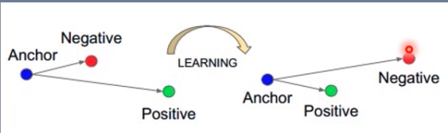

# 前引

- 损失函数：$f(\hat(y),y)$
- 代价函数：$\frac1N \sum_{i=1}^{N}f(\hat(y_i),y_i)$，多个样本的损失函数之和
- 目标函数：cost function+Regularization
- `torch.nn.lossfunction` 实质上也是一个Module，只不过没有parameter
- 下面函数 size_average 参数 与 reduce 后续会被舍弃，被reduction代替


# CrossEntropyLoss

$H(P,Q)=-\sum_{i=1}^{N}P(x_i)log(Q(x_i))$，$P(x_i)$为label，只能为0或者1，退化为下式

$$ loss(x,class) = -log(exp[x[class]] / \sum_{j}exp[x[j]]) = -x[class]+log(\sum_j exp(x[j]))$$

- Logsoftmax 与 NLLLoss的结合，[NLLloss与Crossentropyloss的区别](https://blog.csdn.net/qq_22210253/article/details/85229988)


`CrossEntropyLoss(weight=None,size_average=None,ignore_index=-100,reduce=None,reduction='mean')`

- weight：各类别的loss权值
- ignore_index：忽略某个类别
- reduction：计算模式
  - none：逐个样本计算loss，返回每个样本的loss，向量
  - sum：逐个样本计算loss，进行求和，返回标量
  - mean：逐个样本计算loss，求平均，返回标量
- 输入的input为(batch,class_num)，label为(batch)$\subset[0,classnum-1]$


# NLLLoss

`NLLLoss(weight=None,size_average=None,ignore_index=-100,reduce=None,reduction='mean')`

- 实现负对数似然函数中的负号功能

- `eg:output=[-0.5,-0.2,-0.1] label = [1] NLLLoss = -output[1] = 0.2`

- weight：各类别的loss权值
- ignore_index：忽略某个类别
- reduction：同上
- 输入的input为(batch,class_num,)$\subset[0,1]$，label为(batch,)$\subset[0,1,2,...classnum-1]$


# BCELoss

- 二分类交叉熵
- $loss = -ylogx - (1-y)log(1-x)$
- 输入(batch,)$\subset[0,1]$，label(batch)=0 or 1，输入需先经过sigmoid
- `BCELoss(weight=None,size_average=None,reduce=None,reduction='mean')`


# BCEWithLogitsLoss

- 结合Sigmoid 与 二分类交叉熵
- 输入(batch,)，label(batch)=0 or 1
- `BCEWithLogitsLoss(weight=None,size_average=None,reduce=None,reduction='mean')`


# L1Loss L2Loss

- L1Loss
  - $loss = |x - y|$
  - `L1Loss(reduction='mean')`

- MSELoss
  - $loss = (x - y)^2$
  - `MSELoss(reduction='mean')`

- SmoothLoss
  - 
  - `SmoothLoss(reduction='None')`

# PossionNLLLoss

`PoissonNLLLoss(log_input=True,full=False,eps=1e-08,reduction='None')`

- 泊松分布的负对数似然损失函数
- log_input：输入是否为对数形式
- full：计算所有loss
- eps：修正项，避免$log(input)$为None

- ```python
  log_input = True
  loss = exp(input) - target*input
  loss_input = False
  loss = input - target*log(input-eps)
  ```

  


# KLDivLoss

- 计算KL散度，**计算两个概率分布之间的距离**

  - 与上面的CrossEntropyLoss 以及NLLloss不同，这里衡量的是概率分布，作用更广泛，不仅仅局限于分类

- $D_{KL}(P||Q) = \sum_{i=1}^{N}P(x_i)(logP(x_i)-logQ(x_i))$，其中$P(x)$ 为label，$Q(x)$为output（prediction）

- $loss = y_n(logy_n-x_n)$，其中$y_n$为label，$x_n$为output
  
  - pytorch中公式实现与定义公式不太一致，因此**需要提前将output的概率计算log**
  
- `KLDivLoss(reduction='mean')`

- 输入为(N,\*)，label为(N,*)，二者同shape

- ```
  eg:
  	
     input = [[0.5,0.2,0.3],      label = [[0.2,0.1,0.7],
  (还需经过log)[0.4,0.1,0.5]]               [0.3,0.5,0.2]]
  ```

  

# MargeinRankingLoss

- 计算两个向量之间的相似度，用于排序任务

- $loss(x,y) = max(0,-y*(x1-x2)+margin)$

  - 当y为-1时，希望x1<x2，此时不产生loss

  - 当y为1时，希望x1>x2，此时产生loss

  - ```
    eg:
    x1 = [1,1,3]   x2 = [1,1,4]  y=[1,-1,1]
    loss = [[0,1,1],[0,0,0],[0,1,1]]
    ```

-  `MargeinRankingLoss(margin=0.0,reduction='mean')`

  

# MultiLabelMarginLoss

- 同一个样本有多个标签，为MultiLabel

- 

  - x 为 output，y 为label

  - label的标注格式，eg:

    - ```
      四分类 样本属于0类和3类，则label = [0,3,-1,-1]，label的长度与output等长
      ```

- `MultiLabelMarginLoss(reduction='None')`

- 输入为(batch,class_number,)，label为(batch,class_number,)

# SoftMarginLoss

- 计算二分类损失的logistic loss

​                         $logistic loss =\sum_i log(1+exp(-y_ix_i))$

- logistic loss 用于逻辑回归中，逻辑回归通过sigmoid函数将线性回归的f(x)转换为概率，之后利用BCEloss，利用logistic loss 相当于省去了sigmoid函数的步骤，直接将线性回归输出的f(x)代入logistic loss

- `SoftMarginLoss(reduction)`

- label的标注格式：二维，包含1 or -1

  - ```
    eg: label = [1,-1]     x=[0.2,0.8] 
    logisticloss = log(1+exp(-0.2))
    ```

    


# MultiLabelSoftMarginLoss

$loss(x, y)=- \frac{1}{C} * \sum_{i} y[i] * \log \left((1+\exp (-x[i]))^{-1}\right)+(1-y[i]) * \log \left(\frac{\exp (-x[i])}{(1+\exp (-x[i]))}\right)$

- label 格式 与MultiLabelMarginLoss的label格式不同，eg：

  - ```
    四分类：label=[1,1,0,1] 表示第0类，第一类，第三类在label中
    ```

- 当样本中有某个class时，利用前半部分计算该class的loss，$ \log \left((1+\exp (-x[i]))^{-1}\right)$

- 当样本中没有某个class时，利用后半部分计算该class的loss，$ \log \left(\frac{\exp (-x[i])}{(1+\exp (-x[i]))}\right)$

- `MultiLabelSoftMarginLoss(weight=None,reduction='mean')`
  
  - weight：各class的权重


# MultiMarginLoss

- 计算多分类的折页损失

  $loss(x, y)=\frac{\left.\sum_{i} \max (0, margin-x[y]+x[i])\right)^{p}}{\text { x.size }(0)},i\ne y$

- `MultiMarginLoss(p=1,margin=1.0,weight=None,reduction='None')`
- label 格式 与CrossEntropyLoss的label格式相同


# TripletMarginLoss

- 三元组损失

  ​                       $L(a, p, n)=\max \left\{d\left(a_{i}, p_{i}\right)-d\left(a_{i}, n_{i}\right)+\text { margin, } 0\right\}$                				                        $a:anchor,p:positive,n:negitive$

- 

- `TripletMarginLoss(margin=1.0,p=2.0,eps=1e-06,swap=False,reduction='mean')`
  
  - p：范数的阶，默认为2阶范数

# HingeEmbeddingLoss

- 计算两个输入的相似性，常用于非线性embedding和半监督学习
- 

- $margin = \Delta$
- `HingeEmbeddingLoss(margin=1.0,reduction='mean')`

- **输入的x应为两个输入之差的绝对值**

# CosineEmbeddingLoss

- 采用余弦相似度计算两个输入的相似性
- 

- `CosineEmbeddingLoss(margin=0.0,reduction='mean')`
  - margin:[-1,1]，推荐为[0,0.5]


# CTCLoss

