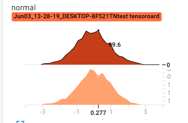

# 前引

- tensorboard的**整体思路**

  - Python脚本中通过**summarywriter**将要记录的数据写入**event file**中

  - terminal中**运行tensorboard**，解析event file中的数据，进行可视化，转发到**6006端口**

    - ```
      tensorboard --logdir='' -->terminal中运行tensorboard
      ```


# SummaryWriter

- 一个写入event_file的高级抽象类 

- `SummaryWriter(log_dir,comment,filename_suffix)`

  - log_dir：指定event_file的存放位置

    - 当不指定时，在当前文件夹创建如下文件结构

      - ```
        runs
        |---date.....comment
        				  |---events.... --》event_file
        ```

  - comment：不指定log_dir时，文件夹的后缀

  - filename_suffix：event file的文件名后缀

# add_scalar

- 记录**标量**

  - 注意：添加的是标量，这就意味着通过重复调用add_scalar才可以最终完成一条曲线的绘制

- `add_scalar(tag,scalar_value,global_step)`

  - tag：图像的title
  - scalar_value：要记录的标量
  - gloabl_step：x轴
  - 相当于(x,y)-->(global_step,sclar_value)

- `add_scalars(main_tag,tag_scalar_dict,global_step)`

  - 绘制多条曲线 

  - main_tag：图像的title
  - tag_scalar_dict：key是变量的tag，value是变量的值


# add_histogram

- 统计直方图与多分位数折线图
  
  - 直方图：统计数据中处于每个区间的数量
- `add_histogram(tag,values,global_step=None,bins='tensorflow',walltime=None)`
  - values：要统计的矢量
  - global_step：相当于y轴
- 

- 上图中下面的是global_step=1绘制的，上面的是global_step=0绘制的，绘制代码如下

- ```python
  for x in range(2):
      np.random.seed(x)
      data_2 = np.random.normal(size=1000)
      writer.add_histogram('normal',data_2,x)
  ```

  

# add_image

- 记录图像

- `add_image(tag,img_tensor,global_step,walltime=None,dataformats='CHW')`

  - img_tensor
    - 若0<img_tensor<1，则会*255
    - 若img_tensor>1 存在，则不会*255
  - dataformats：数据格式

- `torchvision.utils.make_grid(tensor,nrow=8,padding=2,normalize=False,range=None,scale_each=False)`

  - **根据tensor制作网格图**
  - tensor格式：B\*C\*H\*W
  - nrow：行数，列数根据B自动计算
  - padding：图像间距（像素）
  - normalize：是否将像素值标准化，标准化到[0,1]
  - range：标准化范围，指定标准化时的min和max，当未指定时，上述标准化通过从tensor中计算得到
  - scale_each：单独标准化每张图，即B个(C\*H\*w)分别进行标准化
  - pad_value：padding的像素值

  

# add_graph

- 可视化模型的计算图
- `add_graph(model,input_to_model=None,verbose=False)`
  - model：nn.Modle
  - input_to_model：输入模型的数据


# torchsummary

- 查看模型信息
- `torchsummary.summary(model,input_size,batch_size=-1,device='cuda')`
  - model：nn.Module
  - input_size：模型输入size