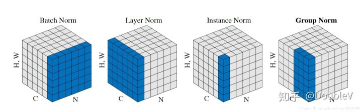
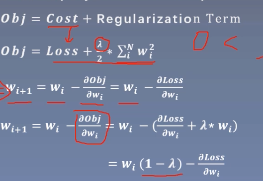

# BatchNorm

​                                $y=\frac{x-\mathrm{E}[x]}{\sqrt{\operatorname{Var}[x]+\epsilon}} * \gamma+\beta$

- 优点
  - 加速模型训练（防止梯度消失）
    - 将数据从饱和区拉到了非饱和区
  - 正则化
    - 在训练中，BN的使用使得一个mini-batch中的所有样本都被关联在了一起，间接地相当于数据增强
- 基本思路
  - 训练的时候，对**每个channel**进行均值和方差计算，同时利用可以学习的$\gamma,\beta$进行仿射变换
  - 测试的时候，使用的均值和方差是训练时记录的均值和方差的平均，而不是重新计算**（加快推理速度）**
  - 具体来说，比如16个卷积核对一张featuremap进行卷积，batch为8，输出（8，16，H，W），则对8个样本相同滤波器卷积得到的featuremap进行均值与方差的计算，$\gamma,\beta$实际上是对每个滤波器分别进行学习，维度为（16）

## BatchNorm1d

- `torch.nn.BatchNorm1d(num_features,eps=1e-05, momentum=0.1, affine=True, track_running_stats=True)`
  - 输入的shape为 (N,C) 或者 (N,C) ，输出为对应的(N,C)或者(N,C)
  - num_features：C的大小
  - eps：在进行计算std时，防止除0的$\epsilon$
  - affine：是否使用$\gamma,\beta$，进行仿射变换
  - track_running_status：在训练的时候，是否记录每个mini_batch的均值和方差，若不记录，则在测试的时候，需要对每个minibatch的均值和方差重新计算
  - momentum：使用指数平均法计算均值的计算
    - $\hat{mean}_{\text {new }}=(1-\text { momentum }) \times \hat{mean}_{old}+momentum\times mean_t$

```python
batchnorm = nn.BatchNorm1d(3)
test = torch.randn((5,3,4))
last_mean = test.mean((0,2))*0.1  <===计算均值
output = batchnorm(test)
output_2 = batchnorm(test)
input_mean = test.mean()*0.1 + last_mean*0.9
>>>batchnorm.running_mean
tensor([-0.0171, -0.0563,  0.0620])
>>>input_mean
tensor([-0.0101, -0.0287,  0.0274])
```


## BatchNorm2d

- `torch.nn.BatchNorm2d(num_features,eps=1e-05, momentum=0.1, affine=True, track_running_stats=True)`
  - 计算方法与BatchNorm1d一致，只是输入不同
  - 输入的shape为(N,C,H,W)，输出为(N,C,H,W)
  - 也就是相当于计算均值时 `input.mean(0,2,3)`

## BatchNorm3d

- `torch.nn.BatchNorm3d(num_features,eps=1e-05, momentum=0.1, affine=True, track_running_stats=True)`
  - 计算方法与BatchNorm1d一致，只是输入不同
  - 输入的shape为(N,C,D,H,W)，输出为(N,C,D,H,W)
  - 也就是相当于计算均值时 `input.mean(0,2,3,4)`


# GroupNormalization



- 从上面这张图可以看出，Batch Norm是单独的一类归一化方法，其他三种是一类

- Group Norm的思路

  - 将每个样本的channel分为多个group，对每个group分别进行归一化

  - 具体来说，比如16个卷积核对一张featuremap进行卷积，batch为8，输出（8，16，H，W），分为4组，则可以reshape为（8，4，4，H，W）

    对**每个样本的每个group**分别进行归一化，之后再reshape为（8，16，H，W），并**对每个通道进行仿射变化**

  - 在test的时候，不同于BN，而是同样实时计算mean和方差

- `torch.nn.GroupNorm(num_groups, num_channels, eps=1e-05, affine=True)`

  - num_groups：分组数
  - num_channels：输入的class

  ```python
  # 没有找到Pytorch中实现的group norm的函数，下面函数计算与pytorch GroupNorm计算出的结果有一点差异
  N, C, H, W = x.size()
G = self.num_groups
  assert C % G == 0
  
  x = x.view(N, G, -1)
  mean = x.mean(-1, keepdim=True)
  var = x.var(-1, keepdim=True)
  
  x = (x - mean) / (var + self.eps).sqrt()
  x = x.view(N, C, H, W)
  return x * self.weight + self.bias
  ```
  
  

# InstanceNorm

- 对每个样本的每个通道进行归一化，仿射变换weight和bias的维度为（C）
- `torch.nn.InstanceNorm1d(num_features, eps=1e-05, momentum=0.1, affin  e=False, track_running_stats=False)`
  - 输入(batch,C,L)，输出(batch,C,L)
  - num_features：channel num
  - affine：是否使用仿射变换，默认不适用
  - track_running_stats：是否记录均值和方差的均值，并在推理的时候使用
- `torch.nn.InstanceNorm2d(num_features, eps=1e-05, momentum=0.1, affine=False, track_running_stats=False)`
  - 输入(batch,C,H,W)，输出(batch,C,H,W)

- `torch.nn.InstanceNorm3d(num_features, eps=1e-05, momentum=0.1, affine=False, track_running_stats=False)`
  - 输入(batch,C,D,H,W)，输出(batch,C,D,H,W)


# LayerNorm

- 对每个样本的所有通道进行归一化，仿射变换weight和bias的维度为（C）
- `torch.nn.LayerNorm(normalized_shape, eps=1e-05, elementwise_affine=True)`
  - normalized_shape：对哪个维度进行归一化，该维度的大小，一般为batch维度


# Dropout

- `Dropout(p=0.5,inplace=False)`
  - p：舍弃概率
- 加在需要Dropout module之前

- 具体实现(Inverted Dropout)：

  - 在训练的时候对权重除以1-p，而在测试的时候不需要

# Weight decay

- L2正则化
- 

- 具体实现：在优化器中指定正则化系数

# 总结

- 上述三种Norm的方法，
  - 区别在于归一化，BatchNorm选择对每个channel进行归一化，LayerNorm选择对每个样本归一化，InstanceNorm选择对每个样本的每个channel归一化，而GroupNorm选择对每个样本的每个channel group归一化，
  - 仿射变化没有区别，都是对于每个channel进行仿射变换
- [几种正则化的区别](https://blog.csdn.net/CV_YOU/article/details/89416210)

