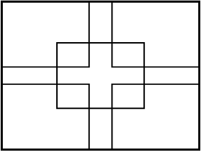

# 前引

- Epoch：所有训练样本输入到模型中
- Iteration：一个batch输入到模型中
- Batchsize：决定了一个Epoch中有几个Iteration

# Dataset

```
class Dataset(object):
	def __getitem__(self, index):
		return ......
	def __len__(self):
		return ....
```

- Dataset需要重写上述两个方法
  - Python中的双下划线方法

# DataLoader

- `torch.utils.data.Dataloader`

- `DataLoader(dataset,batch_size=1,shuffle=False,sampler=None,batch_sampler=None,num_workers=0,collate_fn=None,pin_memory=False,drop_last=False,timeout=0,worker_init_fn=None,multiprocessing_context=None)`
  
  - Dataset：决定数据从哪里读取以及如何读取，Dataset类
  - batchsize：批大小
  - num_workers：多进程读取数据
  - shuffle：每个epoch是否乱序
  - drop_last：当样本数不能被batchsize整除时，是否舍弃最后一批数据
    - 每次for 循环dataloader 返回一个batch
  - dataloader 内部重写了`__next__`和`__iter__`方法，是一个迭代器
  - collate_fn：默认情况下，将同样shape的data进行stack。
  
- **Dataloader 的 执行过程**：以`i,data in enumerate(train_dataloader)`为例:

  - Python 语法 首先 执行`iter(dataloader)` ,根据单线程 or 多线程返回一个迭代器（实现了__next__方法）

    - ```python
      def __iter__(self):
          if self.num_workers == 0:
              return _SingleProcessDataLoaderIter(self)
          else:
              return _MultiProcessingDataLoaderIter(self)
      ```

  - 调用迭代器的next方法

    - 在这里执行的是迭代器对象父类的`__next_`方法，`__next__`中关键的是下面这个方法

    - ```python
      def _next_data(self):
      	index = self._next_index()  # may raise StopIteration
      	data = self._dataset_fetcher.fetch(index)  
      	# may raise StopIteration
      	if self._pin_memory:
      		data = _utils.pin_memory.pin_memory(data)
      	return data
      ```

    - next_index 进入sampler

      - sampler_iter是一个生成器

      - ```python
        def _next_index(self):
            return next(self._sampler_iter) 
        ```

      - ```python
        # 在生成sampler_iter的时候执行下面的iter方法，iter中定义了yield，此时也就是初始化一个generator，返回该generator
        self._sampler_iter = iter(self._index_sampler)
        ........
        # sampler 的 __iter__方法
        def __iter__(self):
            batch = []
            for idx in self.sampler:
                batch.append(idx)
                if len(batch) == self.batch_size:
                    yield batch
                    batch = []
                if len(batch) > 0 and not self.drop_last:
                    yield batch
        ```

        

    - 得到index，通过fetch获取数据

      - ```python
        def fetch(self, possibly_batched_index):
            if self.auto_collation:
                data = [self.dataset[idx] for idx in possibly_batched_index]
             else:
                data = self.dataset[possibly_batched_index]
             return self.collate_fn(data)
        ```

      - 获取数据时利用dataset实现的getitem直接调用dataset[index]方法
      
      - 例：data 包含image和target，batch为3，在未调用colate_fn之前，data布局如下
      
        - ```
          [(image_1,target_1),(image_2,target_2),(image_3,target_3)]
          ```
      
        - collate_fn的作用就是分别拼接(stack)image_1,image_2,image_3和target_1,target_2,target_3,最终输出如下(也就是dataloader iter一次最终的输出)
      
          - ```
            ([image_1+image_2+image_3]('+'代表stack),[target_1+target_2+target_3])
            ```
      
            

# Transforms

- Torchvision中自带了一些Transforms方法,下面没有特殊说明的都是对pillow  image对象进行操作  

## 定义Transform pipeline

- 每一个Transform在Torchvision中都是一个类

- `transforms.Compose([....])`

  - 按照list中Transoforms类的先后顺序，进行transform的pipeline，组成的pipeline成为一个新的transform类

  - ```python
    eg:
    transform = transforms.Compose([transforms.Resize((32,32)),
                       transforms.ToTensor(),
                       transforms.Normalize(norm_mean,norm_std),
                       ])
    ```

    

## 使用Transform

- `transform(img)`  

  - 实际上调用了`__call__`方法

- ```python
  # transform 类 __call__ 方法的实现
  def __call__(self,img):
      for t in self.transforms:
          img = t(img)  --->调用每一个单独transform类的__call__方法
      return img
  ```

  

## Crop

- **CenterCrop**

  - `CenterCrop(size)`
- 从图像的中心裁剪下来指定size的区域
  
- size：（h,w）or int，int的话size为(int,int)
  
- **RandomCrop**

  - `RandomCrop(size,padding=None,pad_if_needed=False,fill=0,padding_mode='constant')`

  - **从图片中随机裁剪出尺寸为size的图片**

    - 先填充，后裁剪，若 指定的size与原图尺寸相同，则裁剪后的图片左上角与填充后图片的左上角重合

  - **padding** ：设置填充大小

    - 当为a时，上下左右军填充a个像素
    - 当为(a,b)时，上下填充b个像素，左右填充a个像素
    - 当为(a,b,c,d)时，左、上、右、下填充a，b，c，d个像素

  - **pad_if_need**：当原始图像大小小于设定size时，则填充

  - **padding_mode**：填充模式，填充像素的值

    - constant：填充的像素恒定，为fill指定的值

    - edge：填充的像素值由图像边缘像素决定

    - reflect：镜像填充，最后一个像素不镜像，eg：[1,2,3,4]—》[3,2,1,2,3,4,3,2]

    - symmetric：镜像填充，最后一个像素镜像，eg：[1,2,3,4]--》

      [2,1,1,2,3,4,4,3]

  - fill：(R,G,B) or (Gray)

- **RandomResizeCrop**

  - `RandomResizeCrop(size,scale=(0.08,1.0),ratio=(3/4,4/3),interpolation)`
  - 裁剪随机大小，随机长宽比的图片，之后缩放到指定的size
  - scale：随机裁剪图片的面积比例，默认为(0.08,1.0)，也就是在[0.08,1.0]之间随机选择一个数作为面积比例
  - ratio：随机长宽比，同scale
  - interploation：插值方法，为Pillow中的插值方法

- **FiveCrop**
  - `FiveCrop(size)` 
  - 将原图裁剪为指定size的五张图
  - 


- **TenCrop**
  - `TenCrop(size,vertical_flip=False)`
  - 将FiveCrop裁剪出的5张图进行翻转，默认进行水平翻转
  - vertical_flip为True，选择竖直翻转而不是水平翻转

## Flip

- `RandomHorizontalFlip(p=0.5)`
  - 依概率水平翻转
- `RandomVerticalFlip(p=0.5)`
  - 依概率竖直翻转

- **RandomRotation**
  - `RandomRotation(degree,resample=False,expand=False,center=None)`
  - degree：旋转的角度
  - expand：是否扩大图像来保存原图像的全部内容
    - 注意：为True的话，意味着图像尺寸的不同，在组成batch时会报错
  - center：旋转点设置，默认为原图像的中心


##   图像变换

- **Resize**
  - `Resize(size,interpolation)`
    - size：(h,w) or int，int的话：短边扩到int，长边等比例扩大
- **Normalize**
  - `Normalize(mean,std)`
- **Pad**
  - 对图像边缘进行填充
  - `Pad(padding,fill=0,padding_mode='constant')`
  - padding：设置填充大小，同RandomCrop中的padding
  - padding_mode：填充模式，同RandomCrop中的padding_mode
  - fill：同RandomCrop中的fill
- **ColorJitter**
  - 调整亮度、对比度、饱和度和色相
  - `ColorJitter(brightness=0,contrast=0,saturation=0,hue=0)`
  - brightness：亮度调整参数
    - 当为a时，从[max(0,1-a),1+a]中随机选择
    - 当为(a,b)时，从[a,b]中随机选择
  - contrast：对比度参数，同brightness
  - saturation：饱和度参数，同brightness
  - hue：色相参数
    - 当为a时，从[-a,a]中选择参数，$0  \le a \le 0.5$
    - 当为(a,b)时，从[a,b]中随机选择，$-0.5 \le a \le b \le 0.5$
- **Grayscale**
  - 将图像转为灰度图
  - `Grayscale(num_output_channels)`
  - num_output_channels：输出灰度图的通道数，为1或者3
    - 为3 实质上是单通道的叠加
- **RandomGrayScale**
  - 随机将图像转为灰度图
  - `RandomGrayscale(num_output_channels,p=0.1)`
- **RandomAffine**
  - 由五种原子变换组成，旋转，平移，缩放，错切和翻转(当然也可以只实现一种原子变换)
  - 不会进行expand扩大（或者缩小）图像的面积
  - `RandomAffine(degrees,translate,scale,shear,resample,fillcolor)`
  - degrees：旋转角度
  - translate：平移区间，如(a,b)，则在宽维度上平移的距离为$width_{img} \times a<dx<width_{img}\times a$
  - scale：缩放比例，(0，1]
  - fill_color：填充颜色设置，(R,G,B)
  - shear：错切，水平错切和垂直错切
    - 若为a：仅在x轴错切，错切角度在(-a,a)之间
    - 若为(a,b)：仅在x轴错切，错切角度在(a,b)之间
    - 若为(a,b,c,d)：则x轴错切角度在(a,b)，y轴错切角度在(c,d)
- **RandomErasing**
  - 随机遮挡
  - 对张量进行操作，而不是PIL.image
  - `RandomErasing(p=0.5,scale=(0.02,0.33),ratio=(0.3,3.3),value=0,inplace=False)`
  - P：执行遮挡的概率
  - scale：遮挡区域的面积（与原图的比例）
  - ratio：遮挡区域长宽比
  - value：设置遮挡区域的像素值，（R,G,B) or (Gray)
- **Lambda**
  - Lambda(lambda)：执行匿名函数（lambda函数）

## Operation

- **RandomChoice**
  - 从一系列transforms方法中随机选择一个进行返回
  - `RandomChoice([transforms1,transforms2,....])`
- **RandomApply**
  - 依据概率执行一组transform操作，返回None 或者 原transforms（compose为新的transform)
  - ``RandomChoice([transforms1,transforms2,....])`
- **RandomOrder**
  - 对compose的transform 打乱顺序，返回打乱顺序的transforms（已经compose为新的transform）
  - `RandomOrder([transforms1,transforms2,....])`

## 自定义Transforms

```python
class user_define_transform(object):
    def __init__(self,...):
        ....
    def __call__(self,img):
        ...
        return img
```
