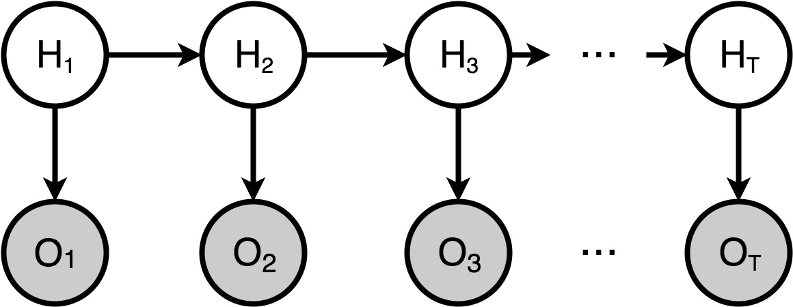
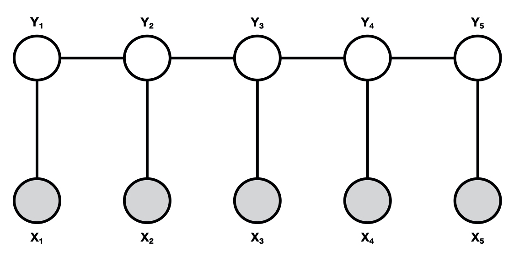

# 概率无向图模型

- 绝对马尔可夫性
- 局部马尔可夫性
- 全局马尔可夫性

- 概率无向图和概率有向图模型的区别
  - 概率有向图模型:  变量之间的连接是**箭头 ** **表示$P(y|x)$**
  - 概率无向图模型：变量之间的连接**不是箭头，表示**$P(y,x)$

# 条件随机场

我们在这里主要说的是线性链条件随机场，**线性链条件随机场和隐马尔可夫模型的区别实际上就是HMM中的所有有向箭头变成了无向的连接线，也就是没有了条件概率的关系，而变成了联合概率**

## 表示

条件随机场最基本的定义查看《统计学习方法》 P220，在这里主要说一下条件随机场的矩阵形式，因为矩阵形式是和隐马尔可夫模型的转移概率矩阵最相似的表示方法

我们知道隐马尔可夫模型由3个要素组成，转移概率矩阵，初始概率分布，观测概率矩阵

那么对应于转移概率矩阵的就是条件随机场的矩阵形式$M_i(x) = [M_i(y_{i-1},y_i|x)]$，在这里的$i$是序列中的第$i$个元素（或者时刻为$i-1$）。隐状态有M种可能，那么也就是一个M*M大小的矩阵。**和隐马尔可夫模型不同的是，这里每一个时刻都会有一个这样的矩阵，而且不同时刻的该矩阵不一定相等，而且该矩阵每一行之和不一定等于1，也就是非规范化概率。除此之外，这个矩阵表示的是联合概率，而隐马尔可夫模型表示的是转移概率。**

概率无向图模型的矩阵简单的例子查阅《统计学习方法》 P223

而初始概率在条件随机场中仍然是用矩阵形式表示的，在这里定义$M_1(x)=M_0(y_0,y_1|x)$。
$$
M_1(x) = \left\{
  \begin{matrix}
   a & b & c \\
   0 & 0 & 0 \\
   0 & 0 & 0
  \end{matrix} 
  \right\} \\ 
y_0 = 1 \\
P(y_1 = 1) = a \\ 
P(y_1 = 2) = b \\ 
P(y_1 = 3) = c \\ 
$$
那么同样的，在条件随机场中也有**概率计算问题，学习问题，预测问题**

而观测概率矩阵，应该是没有对应（至于为什么，目前本人还不知道？当然也可能是有的，但是不是显式的？）

## 概率计算问题

定义前向非规范化概率$\alpha_i(x)$，一个M维向量（共有M种隐状态）
$$
\alpha_i^{T} = \alpha_{i-1}^{T}(y_{i-1}|x)[M_i(y_{i-1},y_i|x)]
$$

