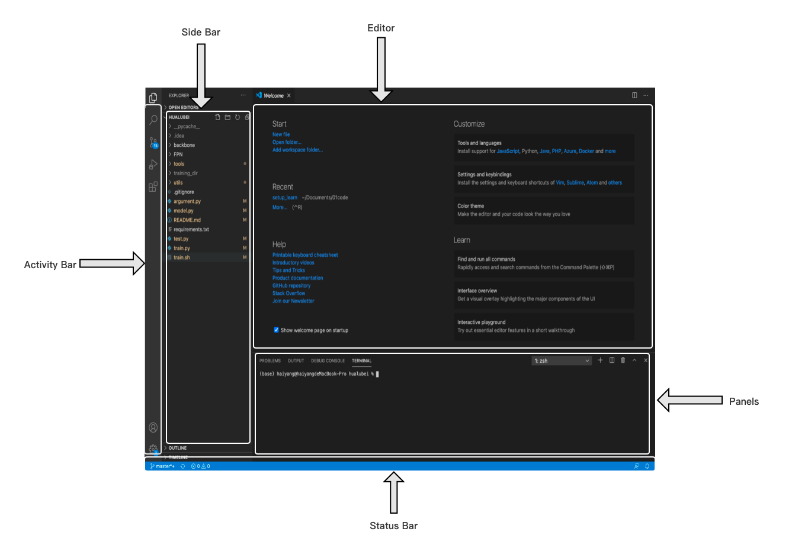
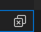
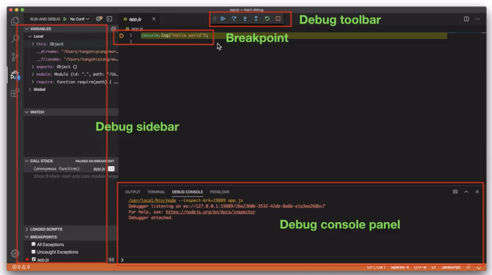
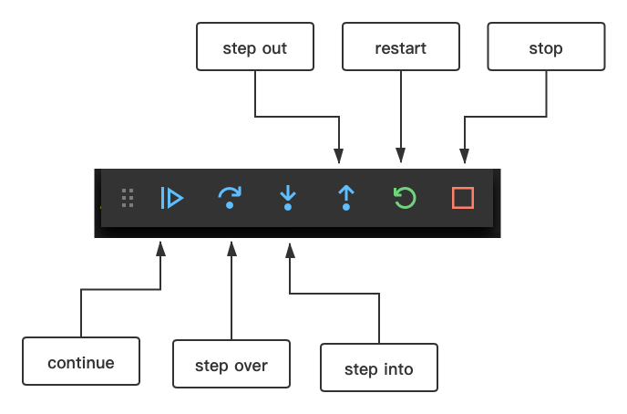

# 打开项目

- 拖拽： 拖拽项目目录到vscode中
- file 菜单栏 
- code命令
  - 安装code命令
    - Windows 和 Linux 默认可以安装
    - macos 安装： view -> command palette -> 输入 path -> install 'code' command in PATH
  - 使用code命令
    - `code 文件夹名称 `打开指定目录下的项目
    - `code .` 打开当前目录下的项目
    - `code -h`   code 命令帮助

# vscode 界面概览

共有五大部分

- 底部的Status Bar（状态栏），用于显示当前被打开文件的一些信息。
- 最左侧的Activity Bar（活动栏），它里面包含了VS Code五个重要功能的入口点。
- Activity Bar旁边的Side Bar（侧边栏），它里面包含了Activity Bar五个功能点的详细内容。
- 右侧，占据空间最多的Editor（编辑器），用于编写代码。
- 编辑器下方的Panels（面板），它包含了4个不同的面板，其中的Terminal面板我们会经常用到。



# Acivity Bar


## Explorer

功能：显示项目所包含的所有文件以及文件夹

包含三个部分（从上到下）：

- OPEN EDITORS：以列表的形式列出了当前打开的所有文件
  - 一键关闭打开的所有文件（最右侧叉叉图标）
    -  
- Project：当前项目中的所有文件
- OUTLINE：可以更容易理解代码的组织结构；很容易地跳转到指定代码块

## Search Tool

功能：文本的搜索和替换

包含两个部分（从上到下）：

- SEARCH，三个高级功能(从左到右)
  - 大小写敏感 Match Case
  - 匹配全单词 Match Whole Word 
  - 正则表达式 Use Regular Expression
- REPLACE 两个高级功能（从左到右）
  - 大小写不敏感 大写变小写 Preserve Case 
  - Toggle Search Details （三个小点） 指定在哪些文件中修改(files to include)，或者哪些文件排除，不进行修改(files to exclude)

## Source Control

- 基于git 进行版本控制， Git GUI
- 使用前提：
  - 搭建了git环境
  - 项目使用git进行管理(git init )
- 最基本的操作，修改了文件或者新增的文件，当保存后，会在Changes 部分显示，比如修改的文件会有`M` 的标示(modified)，新增的文件会有`U`的标示(untracked) ，此时点击文件旁边的`+` 号，即`git add` 添加到暂存区，或者点击文件旁边的撤销箭头，取消此次修改
- `commit ` 操作，在最上方的输入框中输入commit message后，有2种方法进行commit =，一种是点击最上方的 `对号` 进行commit，或者通过快捷键（输入框有提示快捷键）
- 智能`commit` ,  省去add 步骤，vscode完成git add 操作，直接进行commit。使用方法：不需要点击`+`，直接在输入框中输入commit message后进行commit，此时vscode会提示是否**automatically stage all your changes and commit them directly?** 点击yes即可，或者点击always，之后全部都进行智能commit
- git diff 修改文件时，vscode会根据修改的类型，出现不同颜色的指示，红色表示修改，绿色表示新增，蓝色表示修改
- 更多的git push ,git pull 可以点击最上方的`...` 


## Debug

需要满足的条件

- 搭建相应编程语言的开发环境
- 安装相应编程语言用于调试的扩展
- 配置launch.json

Debug 界面概览




Debug的作用

- 程序出现 bug， 修复bug
- 学习源代码，通过调试理清代码的逻辑

### Debug sidebar

- CALL STACK : 程序栈

- VARIABLES： 变量 ，local + global

- WACTH: 可以通过表达式，更方便地查看变量
  - DEBUG SONSOLE: 也可以方便地查看con

### Debug Toolbar



- Continue : 从当前断点跳转到下个断点
- Step over: 无论当前行是否存在函数，都不进入函数内部，继续执行到下一行
- Step into: 若当前行存在函数，则进入函数内部，不存在函数，则继续执行到下一行
- Step out: 跳出当前函数
- Restart: 重启调试
- stop: 停止调试

### launch.json

功能：用于调试的配置文件

- 指定语言环境
- 指定调试类型
- .....


Launch.json 的创建

- 当vscode 打开一个项目时，会分析项目，提示是否需要自动创建launch.json
- 半手动半自动：点击acivity bar中的debug后，点击create launch.json


Launch.json中的内容

- ```
  {
      // Use IntelliSense to learn about possible attributes.
      // Hover to view descriptions of existing attributes.
      // For more information, visit: https://go.microsoft.com/fwlink/?linkid=830387
      "version": "0.2.0",
      "configurations": [
          {
              "type": "pwa-node",
              "request": "launch",
              "name": "Launch Program",
              "skipFiles": [
                  "<node_internals>/**"
              ],
              "program": "${workspaceFolder}/app.js"
          }
      ]
  } 
  ```

- 主要内容为`configurations`中的内容，一个list，每一个元素为一种配置项，可以配置多种配置项

- type: 指定编程环境

- name : 给配置项起名字

- request: launch or attach

  - launch vscode 负责启动程序并给程序搭配一个调试器
  - attach  为一个已经在运行且不支持调试的程序加一个调试器（通常是远程调试，web开发）


## Extension Tool

扩展安装目录：

- mac : 用户目录/.vscode/extensions


## Manager

**Command Palette:** 通过命令执行一些操作

- 输入命令关键词找到命令（简便操作：命令每个单词的首字母）
- 执行方式
  - 鼠标点击 
  - 键盘回车

打开Command Palette快捷键：

- Mac shift +⌘+  P

------

**Settings**

包含两部分 ，User 和 Workspace 

- User 作用于所有项目
- Workspace 只作用于单个项目(当前项目 )
- Workspace 优先级高于 User

可以通过左侧的导航栏和上方的搜索栏快速找到想要修改的setting

修改过的setting左侧会有蓝杠

通过settings.json进行存储，也就是所有的设置项都可以在setting.json中找到（前提是已经修改过，和默认设置不同），同样也就有2个setting.json，一个是user的，一个是workspace的。

setting.json的作用

- 快速去除修改（只要删去setting.json中的某一项就好）
- 快速修改设置（copy 其他人的settings.json)  

------

User Snippets

输入关键词后，按`tab`键即可生成相应的代码片段

如何编写User Snippets

- 在Manager中选择 User Snippets，选择相应的语言，生成相应的模版文件

- ```json
  # example
  "main function": {
  		"prefix": "m",  --> 关键词
  		"body": [  --> 代码片段，每一个元素表示一行代码
  			"int main() {",
  			"\t$0",
  			"\treturn 0;",
  			"}"
  		],
  	"description":"main function"
  	},
  ```

- 几个注意的地方

  - 在编写代码片段的时候，我们可以使用以\$开头的特殊变量：\$0、\$1、\$2、\$3…。\$0用于代码片段生成后，光标最后所处的位置，\$1、\$2、\$3…等用于指定光标移动的位置，当我们按tab键时，光标会依次切换到\$1、\$2、\$3所在的位置。

  - `\t` 代表缩进

  - 代码提示:利用`{}` 

    - ```json
      "print1": {
      		"prefix": "p1",
      		"body": [
      			"printf(\"%${1:you can use: i,s,c,f}\", $2);"
      		]
      	},
      ```

      

  - 枚举:`{||}`

    - ```json
      "print2": {
      		"prefix": "p2",
      		"body": [
      			"printf(\"%${1|i,s,c,f|}\", $2);"
      		]
      	},
      ```

  - 还有很多特殊变量，比如`$CURRENT_YEAR`代表当前年

    - [vscode支持的特殊变量](https://code.visualstudio.com/docs/editor/userdefinedsnippets#_variables)


# Side Bar

隐藏（或者显示）Side Bar: command + B


# Editor

包含两部分：

- minimap：概览代码； 拖动minimap来快速移动到代码的某个区域
- Breadcrumbs: 面包线 包括file path 和 symbol


# Zen mode

**排除干扰，专注写代码**

打开zen mode

- 菜单栏 view -> appearance -> zen mode
- command Palette : zm
- 快捷键： cmd+K+Z 先连续按住cmd + K, 之后松开，之后按住Z


关闭zen mode

- esc
- command Palette : zm


# Panels

包含四部分

- PROBLEMS ： 列出代码中存在的问题
  - Warning
  - Error
- OUTPUT：输出vscode自身或者第三方扩展的一些日志
- DEBUG CONSOLE
  - 输出调试器自身日志
  - 输出程序自身的控制台输出
  - **输出变量，表达式**
- TERMINAL
  - terminal , shell, command的关系：
    - shell负责执行command，也就是将command解释为机器码
    - terminal负责将command输入shell中，并显示shell执行的结果
  - 
    - `+` 表示新增terminal，第二个符号表示新增terminal并与原terminal并列显示，第三个表示删除当前terminal
    - 可以通过下拉列表选择termianl
  - Move panel right 